# 1. Diseño del Esquemático y Lógica del Circuito

El diseño del diagrama esquemático representa la primera y más crucial fase en el desarrollo de nuestra placa de circuito impreso (PCB). En esta etapa de abstracción, el objetivo principal no es definir la geometría física ni la ubicación espacial de los componentes, sino establecer de manera rigurosa la interconectividad lógica (Netlist), definir los flujos de corriente, estructurar las topologías de control y garantizar que se cumplan las normativas de diseño eléctrico (ERC). Para llevar a cabo este proceso, emplearemos la suite de automatización de diseño electrónico (EDA) de código abierto, **KiCad**.

---

## Fase 1: Preparación del Entorno y Estandarización de Librerías

El éxito de la manufactura de una PCB depende directamente de la correcta configuración inicial del entorno de trabajo. Es imperativo que el software y las librerías estén sincronizados con las capacidades de fabricación y el inventario de componentes físicos de nuestro laboratorio.

### 1.1 Descarga e Instalación del Software KiCad
El primer paso consiste en obtener la versión más estable de la suite de diseño. Nos dirigimos al portal web oficial de KiCad. En la página de inicio, localizaremos el panel principal que nos ofrece la documentación, las notas de la versión y, en el centro, el botón principal para la descarga del instalador.

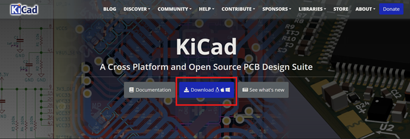
*Figura 1.1: Interfaz principal del portal oficial de descargas de KiCad.*

Al ingresar a la sección de descargas, el sistema nos requerirá especificar la arquitectura y el sistema operativo de nuestra estación de trabajo. Dado que nuestras computadoras de diseño operan bajo este entorno, seleccionaremos la versión correspondiente para **Windows**.

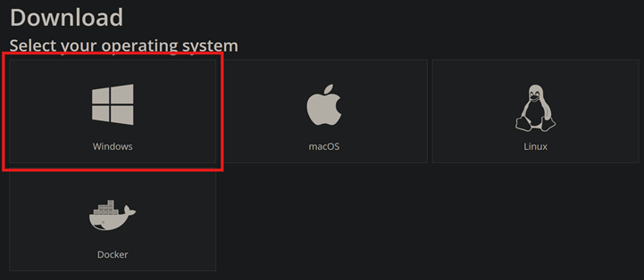
*Figura 1.2: Selección del sistema operativo Windows para garantizar la compatibilidad de los controladores.*

Para optimizar los tiempos de descarga y asegurar la integridad del paquete de instalación, el portal ofrece múltiples servidores espejo (mirrors) distribuidos geográficamente. Seleccionaremos el servidor alojado en **GitHub** ubicado en la región de Norteamérica, lo que nos proporcionará el ejecutable estable. Una vez descargado, procedemos con la instalación dejando los parámetros de variables de entorno por defecto.

*Figura 1.3: Selección del servidor espejo en Norteamérica.*

### 1.2 Estructuración y Creación del Proyecto
Al ejecutar KiCad por primera vez, nos recibe el panel de control unificado. Este gestor central administra todos los archivos vinculados a nuestra placa (esquemas, rutados, modelos 3D y archivos de manufactura Gerber). Para iniciar, crearemos un proyecto nuevo seleccionando el primer icono de la barra lateral izquierda o ejecutando el atajo de teclado `Ctrl + N`.

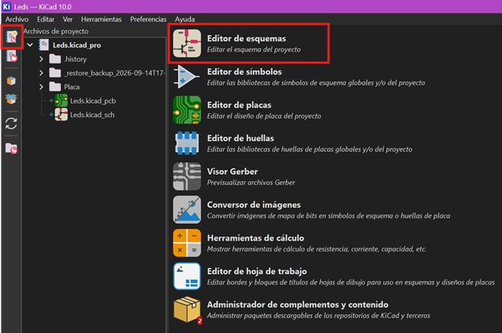
*Figura 1.4: Panel de control unificado y herramienta de creación de nuevos proyectos.*

El software nos solicitará elegir una configuración base. En el selector de plantillas, mantendremos seleccionada la opción **`default`** (Plantilla por defecto de KiCad) y confirmamos haciendo clic en Aceptar. Esta plantilla configura automáticamente las cuadrículas y las reglas de diseño estándar de la industria.

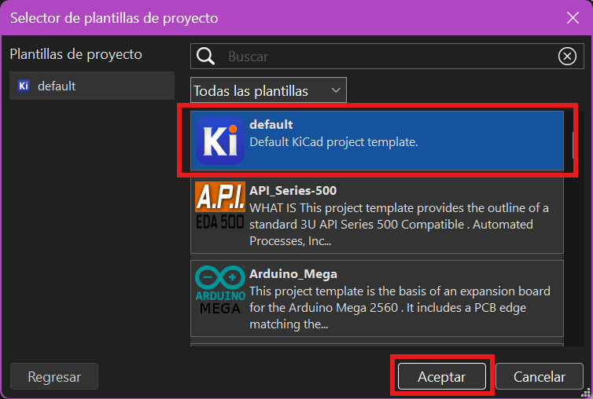
*Figura 1.5: Selección de la plantilla de proyecto predeterminada.*

A continuación, debemos asignar un nombre estructurado y definir el directorio de trabajo. Es vital mantener un orden jerárquico en las carpetas. El sistema generará un archivo maestro con la extensión `.kicad_pro`, el cual actuará como el núcleo que enlaza el esquemático lógico con el diseño físico de la placa.

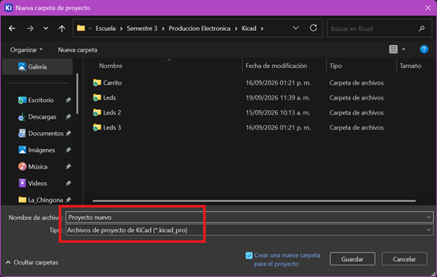
*Figura 1.6: Creación del directorio de trabajo y guardado del archivo maestro del proyecto.*

### 1.3 Integración de Librerías de Manufactura (FabLib)
Uno de los errores más comunes en la ingeniería de PCBs es diseñar utilizando componentes genéricos que luego no coinciden físicamente con los adquiridos. Para evitar discrepancias de empaquetado (footprints), instalaremos la librería estándar de fabricación. Navegamos al menú superior y seleccionamos **`Herramientas > Administrador de complementos y contenido`**.

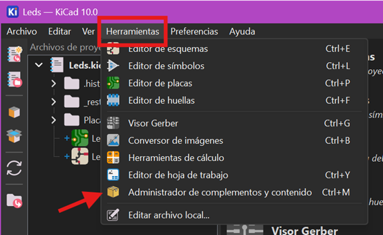
*Figura 1.7: Ruta de acceso al gestor de paquetes y librerías de KiCad.*

Dentro del administrador, utilizaremos la barra de búsqueda ingresando el término **"fab"**. Localizaremos el paquete denominado **`KiCad FabLib`** (fácilmente identificable por su logotipo de un dinosaurio morado). Procedemos a instalar y actualizar este paquete. Su uso garantiza que las dimensiones de las pistas y los pads coincidan milimétricamente con los estándares requeridos por equipos de ruteo CNC.

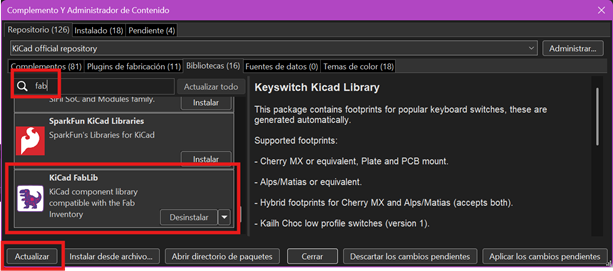
*Figura 1.8: Localización e instalación de la librería estandarizada FabLib.*

---

## Fase 2: Exploración de la Interfaz del Editor de Esquemas

Con el entorno debidamente configurado y estandarizado, procedemos a abrir el **Editor de Esquemas** dando clic en su respectivo icono en el panel de control principal. Aquí es donde realizaremos la captura lógica de los componentes.

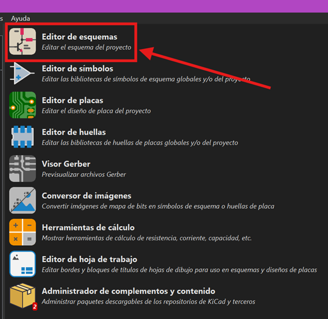
*Figura 2.1: Acceso al entorno de diseño del diagrama lógico.*

### 2.1 Análisis de las Herramientas de Inserción
Dentro del lienzo de diseño, prestaremos especial atención a la barra de herramientas lateral derecha, la cual contiene los accesos rápidos para la inserción de elementos eléctricos:
* 🔴 **Añadir Símbolo:** Herramienta principal (atajo `A`) utilizada para buscar e insertar componentes activos y pasivos (resistencias, capacitores, semiconductores).
* 🔵 **Añadir Símbolo de Alimentación:** Herramienta dedicada (atajo `P`) para establecer los nodos globales de voltaje y planos de tierra (VCC, GND).

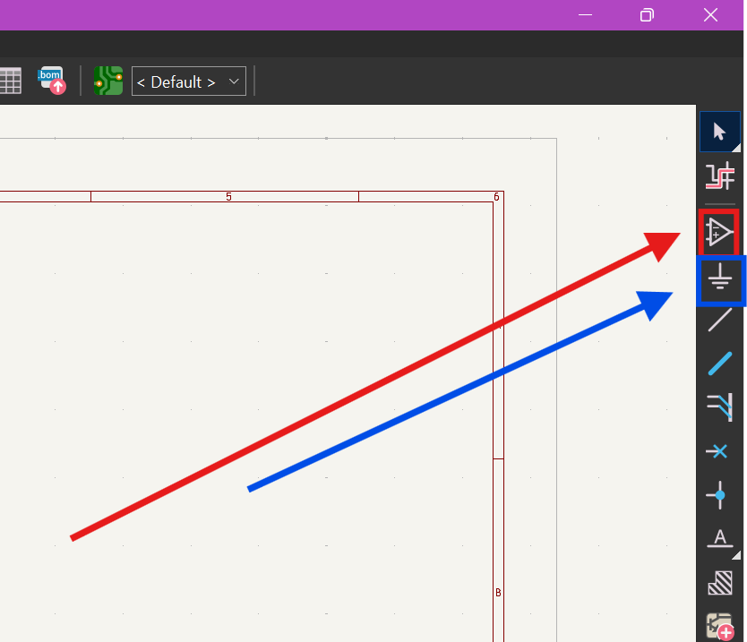
*Figura 2.2: Detalle de la barra de herramientas. Recuadro rojo para símbolos generales y recuadro azul para alimentación.*

Al activar la herramienta de añadir símbolo y buscar un componente (por ejemplo, el diodo emisor de luz `LED_1206`), se despliega una interfaz que nos muestra información crítica. La flecha verde indica el motor de búsqueda, el recuadro rojo muestra la representación lógica según las normativas internacionales, y el recuadro azul nos muestra el **Footprint** (Huella). Es imperativo confirmar que el componente posea una huella asignada antes de dar Aceptar (flecha roja), de lo contrario, no podrá ser ruteado en la PCB.

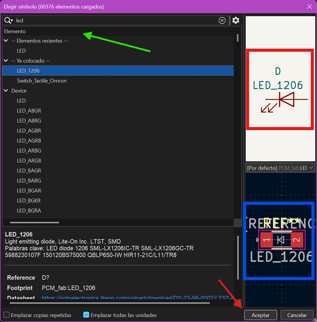
*Figura 2.3: Interfaz de validación de componentes verificando la asociación lógica-física (Footprint).*

Aplicamos exactamente la misma metodología utilizando la herramienta de símbolos de alimentación. Al buscar el término "GND" (Ground), seleccionamos el nodo que servirá como nuestra referencia de 0 voltios para el retorno de las corrientes.

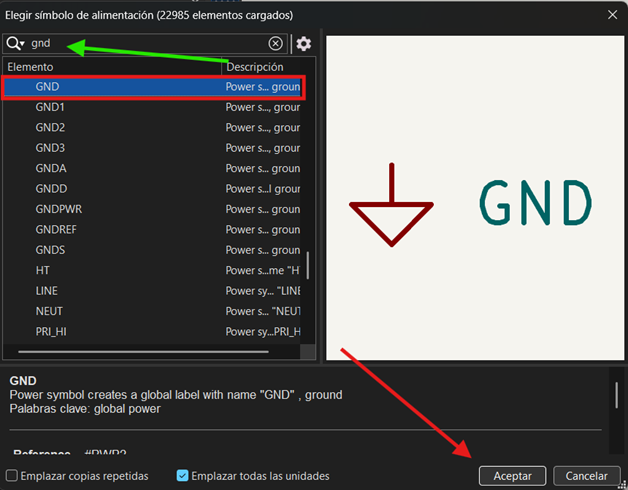
*Figura 2.4: Búsqueda y selección del nodo de retorno común (Tierra).*

Para los componentes pasivos encargados de limitar la corriente, buscamos el término "res" y seleccionamos la resistencia en formato de montaje superficial (SMD) tamaño 1206 (`R_1206`).

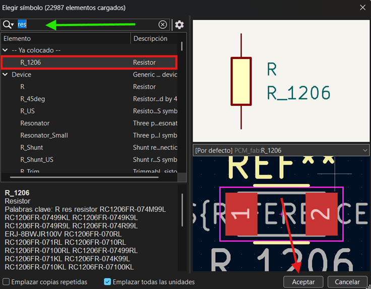
*Figura 2.5: Selección de resistores pasivos para limitación de corriente.*

El objetivo de esta fase de familiarización es prepararnos para construir una topología base de control: un circuito modular diseñado para procesar la señal de un pulsador mecánico y accionar un indicador luminoso (LED). Arquitectónicamente, buscamos alcanzar un diseño análogo al siguiente esquema de referencia:

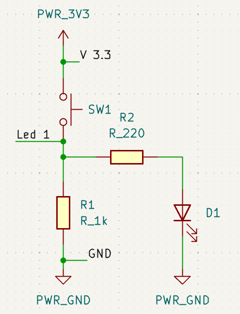
*Figura 2.6: Topología objetivo del circuito de control lógico y potencia.*

---

## Fase 3: Construcción y Ruteo Lógico del Módulo Base

Procederemos a ensamblar nuestro primer módulo funcional. Mantener un orden ortogonal (líneas rectas y componentes alineados) es una convención estricta en el dibujo de esquemas mecatrónicos.

### 3.1 Emplazamiento de Nodos y Componentes
Iniciamos definiendo nuestros planos de retorno. Insertamos dos referencias de tierra globales utilizando la etiqueta estandarizada **`PWR_GND`**.

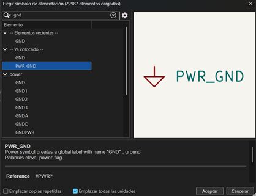
*Figura 3.1: Selección de la etiqueta de tierra de potencia.*

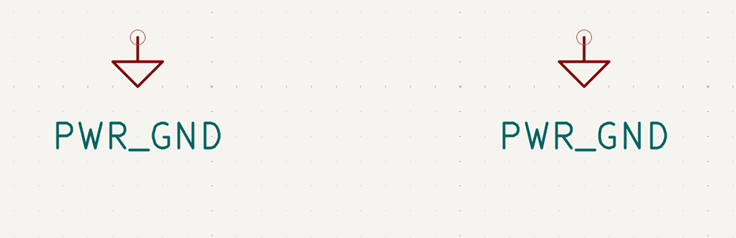
*Figura 3.2: Nodos de tierra posicionados en la base del esquema, siguiendo la convención de diseño.*

A continuación, añadimos dos resistores al lienzo. Para facilitar la lectura del flujo de señal, seleccionamos uno de ellos y presionamos la tecla **`R`** para rotarlo 90 grados, dejándolo en posición horizontal. Estos resistores actuarán como limitadores de corriente (Ohm) para proteger a los semiconductores.

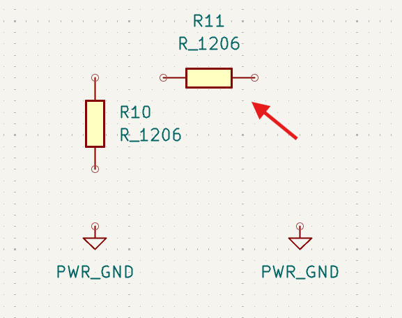
*Figura 3.3: Posicionamiento y rotación ortogonal de los resistores pasivos.*

Buscamos en nuestra librería el diodo emisor de luz ingresando el parámetro `led`.

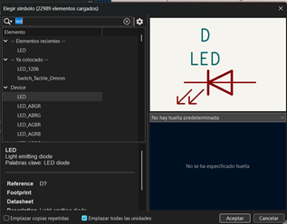
*Figura 3.4: Búsqueda del semiconductor optoelectrónico.*

Posicionamos el LED y lo rotamos adecuadamente. Es crítico que el cátodo (la línea recta en el símbolo del diodo) apunte hacia el nodo de tierra (`PWR_GND`) para garantizar la correcta polarización directa del componente y permitir el flujo de electrones.

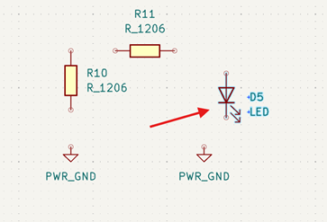
*Figura 3.5: Diodo orientado respetando la polaridad de trabajo.*

Acto seguido, buscamos nuestro actuador de entrada: un botón táctil de montaje superficial (`Switch_Tactile_Omron`). Este componente mecánico cerrará el circuito al ser presionado, permitiendo el paso del voltaje.

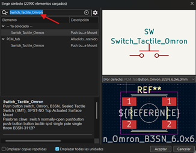
*Figura 3.6: Selección del microinterruptor táctil.*

Posicionamos el switch mecánicamente sobre la resistencia vertical. Para proveer de energía al sistema, insertamos un nodo de voltaje positivo. Buscamos la referencia **`PWR_3V3`** (3.3 Voltios) y la rotamos para que apunte hacia arriba, cumpliendo con la norma que dicta que los voltajes positivos siempre deben fluir desde la parte superior del esquema hacia la inferior.

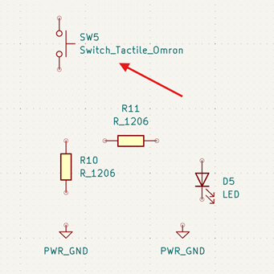
*Figura 3.7: Microinterruptor colocado en línea con la red principal.*

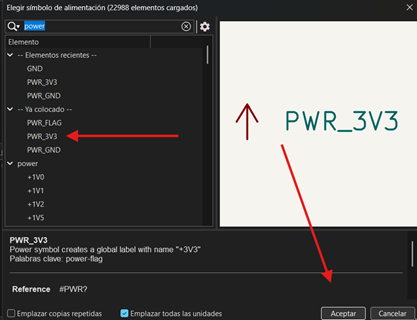
*Figura 3.8: Selección del nodo lógico de alimentación de 3.3V.*

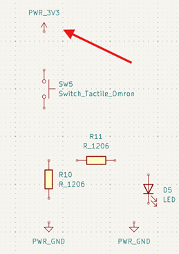
*Figura 3.9: Nodo de potencia emplazado en el extremo superior del módulo.*

### 3.2 Interconexión de Redes Eléctricas (Nets)
Con los componentes emplazados, procedemos a unirlos lógicamente. Al acercar el cursor a los pines de un componente, aparecerá un pequeño círculo. Al hacer clic, iniciaremos el trazado de una red eléctrica (Net).

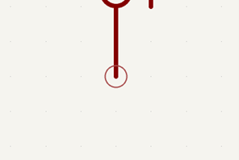
*Figura 3.10: Iniciación de un trazo de conexión (Net).*

Este proceso genera una línea verde que representa un trazo de cobre virtual. Arrastramos esta línea hacia el pin del componente de destino para establecer la continuidad eléctrica.

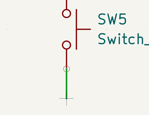
*Figura 3.11: Arrastre ortogonal de la conexión lógica.*

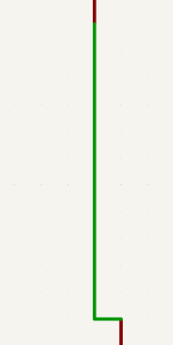
*Figura 3.12: Cierre del circuito vertical entre el switch y la resistencia.*

Cuando necesitamos bifurcar una señal (por ejemplo, tomar voltaje tanto para la resistencia base como para la sección del LED), trazamos la línea perpendicularmente hacia un cable existente. Al hacer clic sobre el cable verde, KiCad generará automáticamente un nodo (representado por un punto verde más grueso), confirmando que hay una unión eléctrica y no solo un cruce visual de líneas.

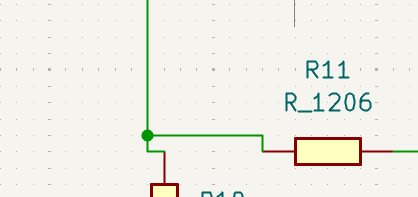
*Figura 3.13: Generación de un nodo de derivación para dividir el flujo de corriente.*

Repitiendo este proceso de cableado para todos los elementos, finalizamos la arquitectura de nuestro módulo base de control e indicación.

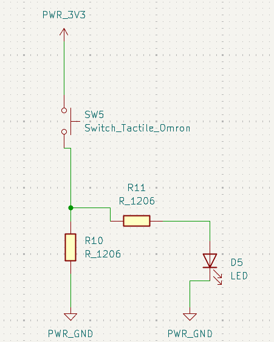
*Figura 3.14: Topología del módulo base interconectada y lista para escalabilidad.*

---

## Fase 4: Escalabilidad, Topologías de Control y Verificación (ERC)

Como el diseño general requiere la monitorización de múltiples entradas, aprovecharemos el diseño modular que acabamos de crear. Seleccionamos la totalidad del circuito base, lo copiamos (`Ctrl + C`) y lo pegamos (`Ctrl + V`) hasta obtener **4 módulos independientes**.

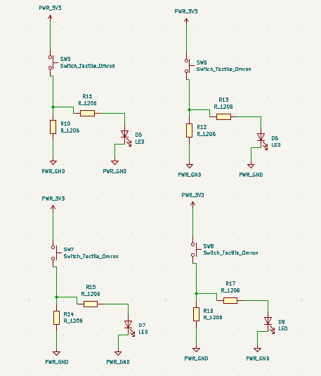
*Figura 4.1: Escalabilidad del diseño mediante la replicación del módulo funcional.*

### 4.1 Alteración de Topologías (Pull-Up y Pull-Down)
En el diseño de sistemas mecatrónicos, es común necesitar diferentes lógicas de disparo (activos en ALTO o activos en BAJO). Para evaluar este comportamiento, modificaremos la arquitectura de módulos específicos:
* En los dos módulos superiores (indicados con **flechas rojas**), intercambiaremos físicamente la posición de la resistencia y el switch. Esto invierte la lógica de lectura respecto a la referencia de tierra.
* En los módulos inferiores (indicados con **flechas azul y verde**) prepararemos el entorno para la inyección de banderas de validación de potencia.

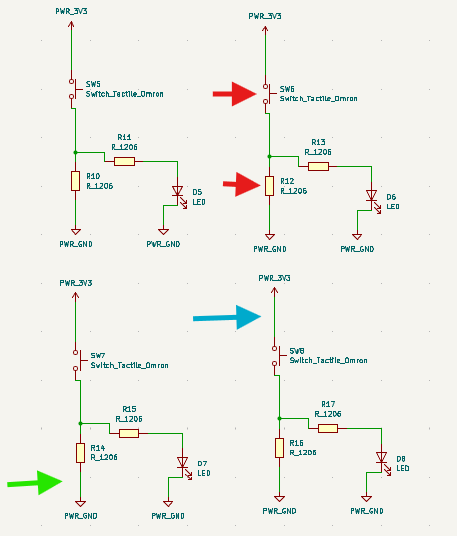
*Figura 4.2: Señalización de los módulos a modificar para crear variaciones topológicas.*

### 4.2 Resolución del Control de Reglas Eléctricas (PWR_FLAG)
KiCad incorpora una herramienta de validación matemática llamada ERC (Electrical Rules Checker). Si el ERC detecta componentes consumiendo energía en una red donde no se ha definido explícitamente un componente que *genere* dicha energía (como un regulador o un conector de batería), arrojará errores críticos de red no alimentada.

Para solventar esto a nivel lógico sin alterar el circuito físico, insertamos el símbolo **`PWR_FLAG`** (Bandera de Poder). Esta bandera le comunica al compilador: *"Esta red recibirá energía desde una fuente externa conectada más adelante"*.

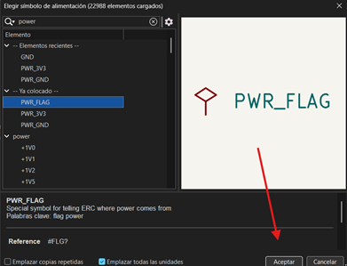
*Figura 4.3: Inserción de banderas lógicas para validación de potencia.*

El diagrama final, aplicando las inversiones topológicas en los módulos superiores y las banderas de poder en los inferiores, debe lucir estructuralmente como se muestra a continuación, garantizando que el diseño compilará sin errores en el ERC.

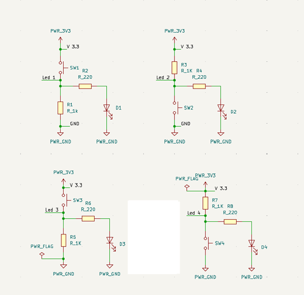
*Figura 4.4: Arquitectura final con modificaciones de estado y validación de reglas superada.*

---

## Fase 5: Conectividad Externa y Etiquetas de Red (Net Labels)

Nuestro circuito lógico necesita conectarse con dispositivos externos (como microcontroladores o fuentes de alimentación). Para ello, utilizaremos conectores y organizaremos el esquemático mediante etiquetas de red.

### 5.1 Documentación y Nomenclatura
Para mantener la legibilidad profesional del plano, utilizaremos la herramienta de texto de la barra lateral derecha para agregar descriptores a nuestras zonas de conexión.

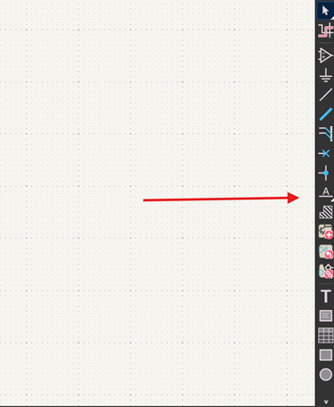
*Figura 5.1: Selección de la herramienta de rotulación de texto.*

El texto en KiCad puede comportarse visualmente como un componente anclado a un nodo.

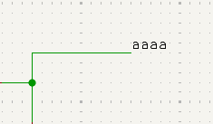
*Figura 5.2: Inserción de rotulación descriptiva en el área de trabajo.*

### 5.2 Inserción de Conectores (Pin Headers)
Procedemos a buscar los terminales físicos de conexión tipo *Through-Hole* (THT). Utilizaremos la familia `PinHeader_01x...`. Requerimos insertar dos de estos componentes:
* Uno de 2 pines (`1x02`) destinado al ingreso del voltaje de alimentación general.
* Uno de 4 pines (`1x04`) destinado a exportar o importar las señales lógicas de nuestros 4 circuitos.

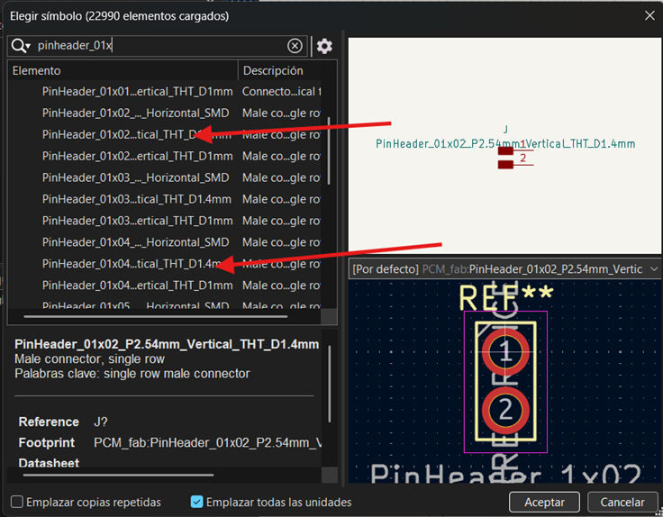
*Figura 5.3: Selección de terminales (Pin Headers) en la librería de componentes.*

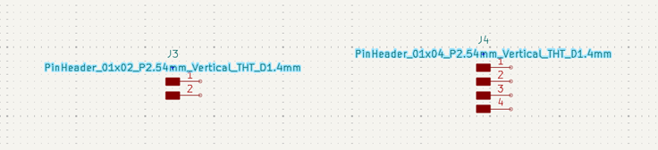
*Figura 5.4: Conectores J3 y J4 posicionados en el lienzo de diseño.*

Para facilitar la interpretación por parte de terceros, damos doble clic sobre los identificadores azules de los conectores y los renombramos explícitamente como "Entradas" y "Salidas".

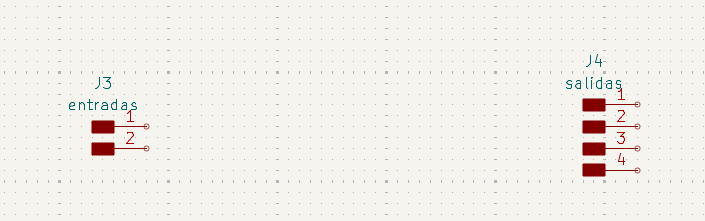
*Figura 5.5: Nomenclatura técnica aplicada a los puertos de interconexión.*

### 5.3 Implementación de Etiquetas de Red (Netlabels)
En el diseño avanzado de PCBs, extender cables a lo largo de todo el diagrama cruzando otros componentes es una práctica deficiente que genera diagramas ilegibles (comúnmente llamado "espagueti"). La solución profesional es el uso de **Etiquetas de Red** (Net Labels).

Asignamos etiquetas lógicas específicas a los pines de nuestros conectores (por ejemplo, `Led 1`, `Led 2`, `V 3.3`, `GND`). El motor lógico de KiCad buscará en todo el diagrama y unirá internamente cualquier pin que comparta exactamente el mismo nombre de etiqueta, estableciendo una conexión virtual perfecta sin ensuciar visualmente el plano.

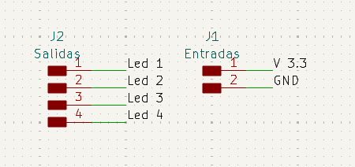
*Figura 5.6: Asignación de variables de red para establecer conexiones inalámbricas lógicas.*

Con la correcta asignación de los puertos, la integración de módulos de lectura/actuación, y la validación de las reglas eléctricas, damos por concluido de manera exitosa el diseño del diagrama esquemático. La Netlist generada a partir de este documento servirá como el mapa fundacional para la etapa de ruteo físico de la PCB.

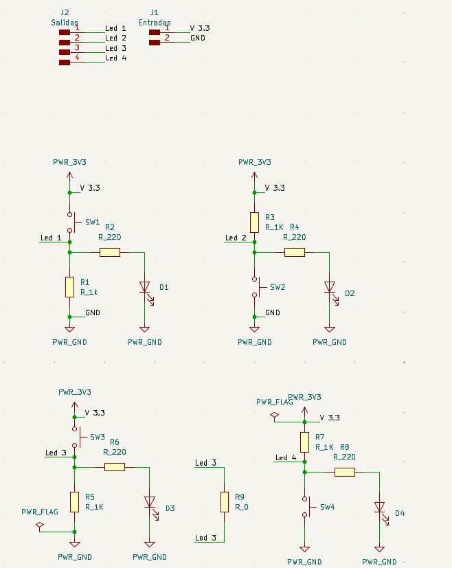
*Figura 5.7: Diagrama esquemático mecatrónico finalizado y listo para exportación al entorno PCB.*

---

# 🛠️ Editor de Placas (PCB Layout)

Una vez que el diseño lógico ha sido validado en el esquemático, el siguiente paso crítico en nuestro flujo de trabajo es la traducción de este circuito a su forma física. En esta sección documentamos la importación de huellas (footprints), la definición del área de trabajo, el ruteo y la preparación para la exportación a manufactura CNC.

---

## 1. Transición al Entorno de PCB

Para comenzar con el diseño físico, utilizamos el botón **Abrir editor de placas** ubicado en la barra de herramientas superior del Eeschema. Una vez listo el esquemático, vas a ir a la esquina superior izquierda y vas a dar clic en el icono verde que está marcado en la imagen con un cuadro rojo, para empezar con el editor de placas[cite: 9].

| Icono Editor de Placas | Acceso desde Eeschema |
| :---: | :---: |
| 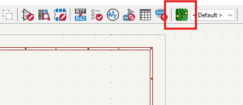 |  |

!!! warning "Importante: Gestión del Proyecto"
    Es fundamental realizar este paso con la ventana principal del **Proyecto de KiCad** abierta en segundo plano. Si se abre el editor de placas de manera independiente, el software perderá el enlace con el esquemático, imposibilitando la sincronización de componentes y arrojando errores de conectividad al intentar actualizar.

---

## 2. Sincronización y Organización de Componentes

Con el editor de placas abierto, procedemos a importar los componentes lógicos a su representación física. Esto se logra ejecutando la herramienta **Actualizar placa desde esquema** (atajo de teclado `F8`). 

Al aplicar los cambios, tus componentes aparecerán así en la parte principal de la pantalla y, como se puede observar en las flechas, hay pequeñas líneas azules que conectan los componentes entre sí[cite: 9]. A esta red de guías virtuales se le conoce como **Ratsnest** (nido de ratas), el cual nos indica el orden, la topología y el destino exacto de cada conexión.

| Ventana de Actualización | Disposición con Ratsnest |
| :---: | :---: |
|  |  |

*Disposición de los componentes interconectados mostrando las conexiones virtuales.*

---

## 3. Configuración de Capas de Trabajo y Reglas de Diseño (DRC)

Antes de iniciar el trazado de pistas o contornos, debemos comprender el apilamiento de capas (Layer Stackup). Dado que el diseño actual es una placa de cara simple (una sola capa de cobre), todo nuestro trabajo conductivo se realizará en la capa **F.Cu** (Front Copper / Cobre Frontal).

En la parte superior izquierda podemos observar una opción que dice “Pista: usar el ancho de clase de red”; le vas a dar clic y te abrirá una lista de opciones y después pondrás la opción de editar tamaños predefinidos que está seleccionada con color morado[cite: 9].

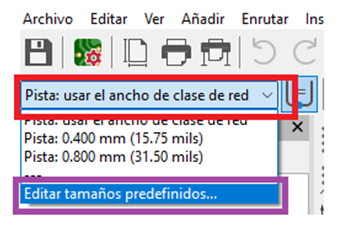
*Selección rápida de anchos de pista predefinidos.*

Te aparecerán varias opciones, pero las importantes son los tamaños predefinidos; darás clic en la parte de abajo donde hay un signo de más (+) y añadirás dos medidas: una de **0.4 mm** y otra de **0.8 mm**, igual como se muestra en la imagen[cite: 9].

| Configuración de Tamaños Predefinidos | Menú de Propiedades de la Placa |
| :---: | :---: |
|  |  |

*Definición de márgenes mínimos, aislamiento y tolerancias de diseño.*

!!! info "Parámetros para CNC Monofab SRM-20"
    Se estableció un **ancho de pista de 0.4 mm** para las líneas de señal. Este grosor garantiza que la fresadora pueda aislar las pistas correctamente sin comprometer su integridad mecánica ni su conductividad.

---

## 4. Enrutamiento y Conexiones (Capa F.Cu)

Seleccionarás la medida de 0.4 mm y es hora de conectar todos tus componentes[cite: 9].

Después, deberás seleccionar la capa **F.Cu** que está marcada con un recuadro rojo y usarás la herramienta que está marcada de verde (Enrutar pistas), que nos va a ayudar a poder conectar nuestros componentes, de igual manera como se logra ver en el recuadro naranja[cite: 9].

| Selección de Capa F.Cu | Herramienta de Enrutamiento |
| :---: | :---: |
|  |  |

Al seleccionar la herramienta de pistas y hacer clic sobre un pad, KiCad ilumina automáticamente los pads de destino correspondientes, facilitando la visualización del camino a seguir.

| Resaltado de Destino | Conexión Completada |
| :---: | :---: |
|  |  |

### Herramientas de Alineación y Buenas Prácticas
Algunas opciones para acomodar mejor tus componentes es seleccionar dos componentes y dar clic derecho, seleccionar **alinear/distribuir**; puedes ocupar la alineación a la izquierda o las otras alineaciones para ayudarte a acomodar tus componentes[cite: 9].

*Menú contextual para simetría y distribución de huellas.*

Cuando juntes tus componentes, recuerda que **no debe haber ángulos de 90°** en las líneas rojas y tampoco se pueden encimar[cite: 9].

*Trazos óptimos a 45 grados evitando esquinas de 90 grados.*

---

## 5. Trucos de Ruteo: Puentes (Jumpers)

Al trabajar exclusivamente en una cara (Capa `F.Cu`), es común encontrarnos con cruces inevitables donde una pista bloquea el paso de otra.

Aunque cuando llega a pasar el caso de necesitar poner una línea encima de la otra, puedes ocupar el truco de la **resistencia 0**[cite: 9]. El truco consiste en agregar una resistencia 0 (0 ohmios) y poder unir las dos líneas actuando físicamente como un puente o "jumper", aunque tengas una línea de frente igual como se muestra en el recuadro verde[cite: 9].

| Implementación Práctica del Jumper | Vista en el Layout |
| :---: | :---: |
| 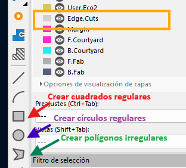 |  |

!!! tip "Consideración en el DRC"
    El uso de este puente puede generar advertencias en el chequeo de reglas de diseño (DRC), ya que lógicamente el software lo ve como una interrupción de la red. Sin embargo, en la manufactura física, esta es una técnica completamente válida y la advertencia puede ser ignorada de forma segura.

---

## 6. Delimitación del Contorno (Edge.Cuts)

Toda PCB necesita un límite físico definido para que la máquina CNC o el fabricante sepa por dónde cortar la placa terminada. 

Una vez ya tengas tus componentes acomodados y conectados, vas a seleccionar la capa **Edge.Cuts** y deberás usar las diferentes herramientas (como crear cuadrados regulares, círculos regulares y polígonos irregulares) para poder crear una figura alrededor de tus componentes haciendo la delimitación de la placa[cite: 9].

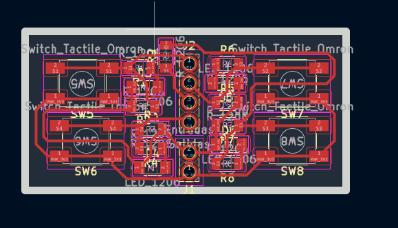
*Selección de la capa Edge.Cuts y herramienta gráfica.*

El contorno de tu figura debería verse algo parecido a esta imagen[cite: 9].

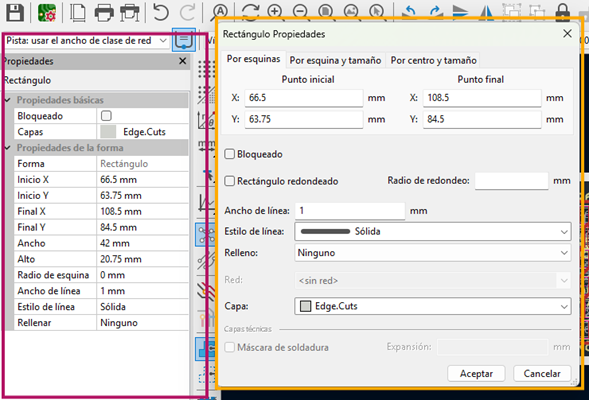
*Geometría de corte exterior encapsulando los componentes.*

Si das doble clic en el cuadro te aparecerán las propiedades de la figura que creaste, aunque del lado izquierdo en el rectángulo violeta también podrás observar las propiedades[cite: 9].

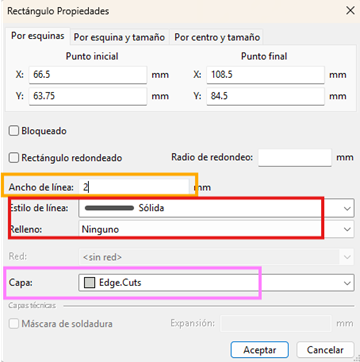
*Inspector de propiedades del trazado.*

Deberás cambiar el ancho de la línea dependiendo los puntos que tengas disponibles para tu máquina; en mi caso son **dos milímetros**, el estado de línea debe ser sólida y en relleno es ninguno, además de observar la capa en la que se encuentra tu figura, es importante que esté en **Edge.Cuts**[cite: 9].

*Configuración geométrica adaptada a la fresa de la CNC.*

Como puedes observar, las líneas de la figura que está alrededor de tu circuito ya miden **2mm de ancho**, el tamaño de la broca que se tiene[cite: 9]. Para confirmar esto, podemos usar la **Herramienta de medida (Ctrl+Shift+M)**.

| Verificación de Grosor (Cota) | Herramienta de Medición |
| :---: | :---: |
|  |  |

---

## 7. Perforaciones Manuales (Capas de Usuario)

Para la colocación de pines (pin headers) y sujeciones, necesitamos definir perforaciones precisas sin interferir con las capas estándar.

Cuando acabes con la figura de alrededor, seleccionarás la capa **User.1** y pondrás la herramienta de círculo para crear círculos en la parte de pines, voltaje y GND; es importante que sean del mismo tamaño de los agujeros[cite: 9]. 

!!! info "Gestión de Capas de Usuario"
    *   **User.1** es para perforaciones[cite: 9].
    *   **User.2** va a ser para etiquetas[cite: 9].
    *   **User.3** se ocupa normalmente para círculos donde van los tornillos[cite: 9].

| Trazado en User.1 | Ajuste de Radio y Relleno |
| :---: | :---: |
| 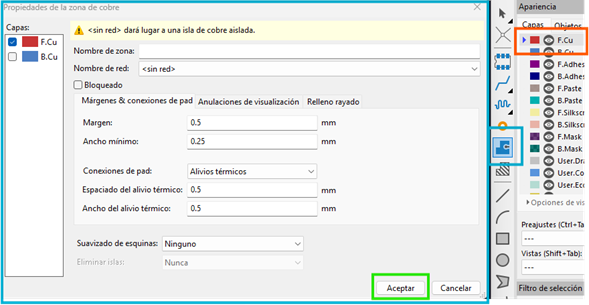 |  |

Con la herramienta de círculo dibujamos guías con la propiedad de **Rellenar con Sólido** y un radio de aproximadamente 0.72 mm a 0.8 mm. Es vital asegurarse de que estos círculos queden perfectamente centrados en los pads para guiar la broca.

---

## 8. Creación de Zonas de Cobre (Copper Pour)

El último paso del diseño físico consiste en generar una zona de relleno (Copper Pour). Esto delimita el área de cobre que la CNC debe procesar y optimiza el tiempo de fresado al evitar remover material innecesario.

Después vas a seleccionar la capa **F.Cu** otra vez, donde darás clic en la herramienta de añadir zonas rellenas y te aparecerá una advertencia (indicando `<sin red>`); lo único que debes hacer es dar clic en aceptar[cite: 9].

| Selección de Herramienta | Advertencia de Zona |
| :---: | :---: |
|  |  |

Una vez le des clic en la herramienta te aparecerá una forma parecida a la del polígono irregular, es importante que cierres bien el sistema trazando el polígono por el interior de nuestro contorno para que se vea rojo el polígono[cite: 9]. La regla fundamental es que **el polígono debe ser un lazo completamente cerrado**.

*El contorno del área de relleno delimitando todo el circuito.*

---

## 9. Ejecución del Relleno de Cobre

Y por último, solo deberás presionar la **tecla B** para que se complete la figura[cite: 9]. Este comando obliga a KiCad a recalcular y renderizar el relleno de cobre, esquivando automáticamente las pistas y los pads según las reglas de aislamiento configuradas previamente.

| Polígono Procesado | Detalle de Aislamiento |
| :---: | :---: |
|  |  |

*Visualización general de la placa terminada en alto contraste.*

---

## 10. Verificación de Reglas de Diseño (DRC)

El último filtro de seguridad antes de fabricar es ejecutar el **DRC (Design Rule Checker)**. A diferencia del ERC en el esquemático, el DRC verifica errores físicos.

Para comprobar si hay errores en la placa existe la herramienta que está seleccionada con el cuadrado verde y te abrirá el cuadro verde más grande[cite: 9]. En la parte inferior, en el recuadro rojo, podrás observar los errores que están en la placa; en mi caso me aparece un error, pero es porque falta una conexión, pero esa conexión ya está conectada internamente en los botones, por lo tanto no es tan importante conectarlas[cite: 9]. 

Los avisos que están en amarillo no afectan al funcionamiento de la placa, es normal que aparezcan varios avisos al crear una placa tan compacta[cite: 9].

| Botón Ejecutar DRC | Resultados de la Verificación |
| :---: | :---: |
|  | 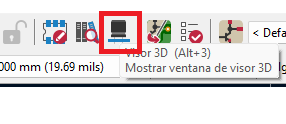 |

---

## 11. Inspección en el Visor 3D y Orientación

Antes de exportar los archivos para fabricación, es una excelente práctica revisar el aspecto físico de la placa. Otra de las herramientas es la que está en la parte superior y se llama **visor 3D (Alt+3)**, te ayuda a observar tu placa en formato 3D con sus componentes y todo[cite: 9].

| Acceso al Visor 3D | Renderizado Frontal |
| :---: | :---: |
|  | 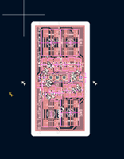 |

Al darle clic podrás visualizar en tercera dimensión tu placa, lo que te puede ayudar a ver si los componentes están organizados de buena forma o si necesitan algún arreglo y verificar que las perforaciones mecánicas no colisionen[cite: 9].

*Inspección final isométrica de la distribución física.*

Por la forma de la cortadora de monofab y la placa, es importante que coloques tu figura en la dirección que más te convenga; solo tienes que seleccionar toda tu placa y presionar la **letra R** para rotar[cite: 9].

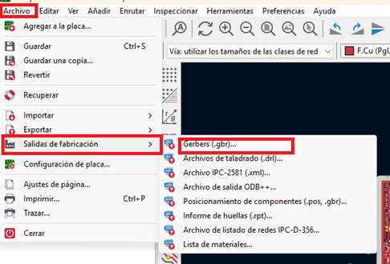
*Orientación geométrica de todo el bloque (Rotate).*

---

## 12. Salidas de Fabricación (Exportación SVG)

Para procesar nuestra placa en la fresadora CNC, necesitamos exportar el diseño. Cuando ya tengas tu placa sin errores y con la dirección correcta, es hora de que te vayas a la ventana de archivo, luego a **salidas de fabricación** y por último a **Gerbers**[cite: 9].

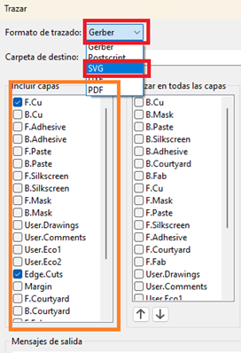
*Acceso al menú de exportación de archivos.*

Te abrirá una ventana y apretarás en la ventana roja donde diga Gerber y seleccionarás **SVG**[cite: 9]. En el recuadro naranja encontrarás una lista de las capas y seleccionarás las capas que ocupaste, en nuestro caso serían **F.Cu, Edge.Cuts, y User.1**[cite: 9].

*Selección del formato vectorial monocromático y las capas necesarias.*

Para finalizar, seleccionarás la opción de **Ajustar página a la placa** y después pondrás en **Trazar**, lo que te creará la misma cantidad de archivos que seleccionaste en incluir capas en la misma carpeta de tu proyecto[cite: 9].

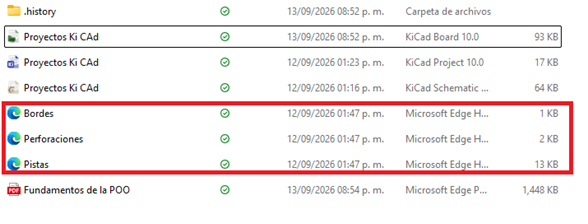
*Ejecución de la herramienta de trazado vectorial.*

### Archivos de Salida (Arte de Manufactura)

Como resultado, KiCad generará un conjunto de archivos `.svg` independientes. Podrás abrir cada uno de los archivos para comprobar que todo esté bien y ponerles su respectivo nombre[cite: 9].

*Listado de archivos vectoriales (Bordes, Perforaciones y Pistas) listos para el maquinado CAM.*

A continuación, se muestra una previsualización del archivo de pistas principales. Este formato de alto contraste permite al software de la fresadora calcular las rutas de corte impecablemente.

*Vista de alto contraste del arte generado para la capa de cobre frontal.*

---

# 3. Manufactura CAM y Generación de Trayectorias (Mods CE)

!!! abstract "Objetivo de esta fase"
    Una vez validados los diseños y generados los archivos de las capas de nuestra placa en KiCad, es necesario "traducirlos" a un formato de trayectorias espaciales (G-Code/Toolpaths) que la fresadora CNC **Roland Monofab (SRM-20)** pueda interpretar para realizar el corte y desgaste físico del cobre.
    Para realizar esta conversión utilizaremos **Mods CE** (Community Edition), una plataforma basada en navegador e ideal para la generación de trayectorias de fresado de PCBs mediante un sistema de nodos.

---

## 3.1 Exportación Vectorial desde KiCad (Archivos Base)

El proceso comienza aislando y exportando las capas necesarias desde el editor de KiCad en formato vectorial (`.svg`). 

Para que la máquina pueda saber qué hacer, es necesario seguir estos pasos: primero, una vez que tenemos nuestra placa terminada, nos dirigimos al menú superior y seleccionamos la ruta **`Archivo > Salidas de fabricación > Gerbers...`**. Esta herramienta nos permite compilar la geometría de la PCB.

*Figura 3.1: Acceso al módulo de exportación de archivos de fabricación.*

En la ventana de trazado, el formato predeterminado suele ser Gerber. Debemos abrir el menú desplegable en la parte superior izquierda.

*Figura 3.2: Selección del menú de formatos de trazado.*

Cambiamos el formato de trazado estrictamente a **SVG**. A diferencia de los archivos Gerber tradicionales, el formato SVG (Scalable Vector Graphics) genera imágenes monocromáticas de alto contraste que Mods CE utiliza para calcular las operaciones de desgaste de cobre.

Ahora en la flecha verde (columna izquierda) seleccionamos solo las capas que utilizaremos (pistas y cortes de borde). La opción que está señalada por la flecha azul (**"Comprobar relleno de zonas antes de trazar"**) es necesario activarla obligatoriamente para garantizar la integridad de los planos de tierra. Al final le picamos "Trazar".

*Figura 3.3: Ajuste de parámetros vectoriales y selección de capas a exportar.*

Los archivos estarán guardados en formato Microsoft Edge documents (o el navegador por defecto), con la extensión en SVG. Debemos tener listos los archivos correspondientes a las **pistas**, **perforaciones**, **bordes** y **etiquetas** (opcional).

| Archivos Exportados Localmente | Archivos Base Listos para Mods CE |
| :---: | :---: |
|  |  |

---

## 3.2 Acceso y Configuración del Entorno Mods CE

Para configurar nuestro espacio de trabajo CAM, seguimos esta ruta de inicialización:

1. Ingresamos a nuestro navegador y realizamos la búsqueda de **"mod ce"** o entramos a la página oficial [Mods CE](https://modsproject.org).

*Figura 3.4: Búsqueda del entorno de procesamiento modular.*

2. En la interfaz principal (identificable por el logo de la carita feliz en la pestaña), hacemos clic derecho o buscamos el menú de opciones en la esquina superior izquierda para abrir los **Programs**.
3. En la barra de búsqueda tecleamos "sr" para filtrar las máquinas, navegamos hacia la sección de máquinas Roland y seleccionamos la opción **`mill 2D PCB`** (señalada por la flecha roja).

*Figura 3.5: Selección del algoritmo de ruteo 2D para la máquina Roland SRM-20.*

{ width="30%" }
{ width="30%" }
{ width="30%" }

Al cargar el programa, se desplegará una red de nodos interconectados (diagrama de flujo de datos) que procesarán nuestro archivo desde el SVG hasta el archivo de corte de la máquina. El paso siguiente es venir al primer apartado (nodo raíz) para seleccionar el archivo.

| Nodo Raíz de Inserción | Entorno Completo de Nodos |
| :---: | :---: |
|  |  |

---

## 3.3 Configuración de Pistas (Traces)

Comenzaremos procesando el archivo de las pistas (`Pistas.svg`). En el nodo de entrada `Roland Monofab PCB`, seleccionamos y cargamos nuestro archivo SVG.

*Figura 3.6: Geometría de las pistas importada exitosamente al entorno CAM.*

Ahora damos clic en el botón **`invert`**. Esto es un paso técnico crítico: le indica a la máquina que el objetivo es realizar un fresado de aislamiento (remover el cobre *alrededor* de los vectores) y no taladrar sobre las líneas de la pista, lo cual destruiría nuestro circuito.

*Figura 3.7: Proceso de inversión lógica para ruteo de aislamiento.*

A continuación, configuramos los parámetros de la herramienta física:

!!! tip "Parámetros de la Broca"
    Para el fresado de las pistas utilizaremos una broca plana estándar. En el nodo de configuración (*set PCB defaults*), bajamos un poco en la página, damos clic donde señala la flecha azul (para cambiar a mm) y escogemos la opción **`0.40mm flat`** señalada por la flecha roja (lo que equivale aproximadamente a 1/64 de pulgada).

| Selección de Herramienta | Parámetros del Nodo |
| :---: | :---: |
|  |  |

### Ajuste de Pasadas (Offsets)
En el nodo **mill raster 2D**, definiremos cuánto material queremos remover alrededor de cada pista:
*   **Offset number:** Lo configuramos en `2`. Esto indica que el taladro realizará dos pasadas concéntricas alrededor de las pistas para asegurar un aislamiento adecuado, ajustado a este valor para evitar problemas técnicos de ruteo.
*   Una vez configurado, hacemos clic en el botón **Calculate**.

| Nodo General | Cálculo de Trayectorias |
| :---: | :---: |
|  |  |

---

## 3.4 Visualización y Renderizado

Al presionar *Calculate*, Mods CE generará visualmente el trazado de las rutas de corte de la herramienta (toolpath). 

Podemos hacer clic en el botón **View** para obtener un renderizado 3D de cómo quedará la placa físicamente. 

!!! warning "Interpretación del Renderizado"
    En el renderizado 3D, **el área oscura representa el cobre que será removido** por la fresadora, mientras que el área clara e intacta representa nuestras pistas y pads eléctricos. 

---

## 3.5 Origen y Velocidad (Nodo SRM-20)

El paso final antes de exportar el archivo es configurar los parámetros físicos y la cinemática de la máquina en el nodo final **Roland SRM-20 milling machine**:

*   **Speed (Velocidad):** Ajustamos la velocidad de fresado a **4 mm/s** para evitar rupturas en la broca y asegurar cortes limpios en las pistas.
*   **Origin (Origen de coordenadas):** El siguiente paso es definir los ejes y escribiremos **0** en los 3 ejes (**X: 0, Y: 0, Z: 0**) donde se señala con las flechas rojas para la fabricación de una placa individual principal.

!!! tip "Optimización de Material (Multipanel)"
    Es importante saber que si queremos agregar otra placa para imprimir (panelización), solo modificamos el eje de las X, con un margen de 2 mm extra para que se hagan adecuadamente los bordes perimetrales sin chocar.

| Origen 0,0,0 (Detalle) | Configuración final de máquina |
| :---: | :---: |
|  |  |

---

## 3.6 Guardado y Organización de Archivos

Para finalizar con el primer documento, nos dirigimos a este apartado de cálculo, confirmamos que todo esté en orden, nos vamos al final de la página (al último nodo) y le picamos al botón **`save file`**. El navegador descargará automáticamente un archivo con la extensión `.rml` (Roland Machine Language). 

| Confirmación de Cálculo | Botón Save File |
| :---: | :---: |
|  |  |

!!! danger "Importante: Renombrar los archivos"
    Por defecto, Mods CE guarda todos los archivos bajo el nombre genérico `SVG image.rml`. Es **crucial** ubicar el archivo descargado inmediatamente y renombrarlo (por ejemplo, a `1_Pistas.rml`) para mantener una organización estricta y evitar confusiones fatales al momento de operar la fresadora.

| Botón Save File (Detalle) | Archivo Descargado |
| :---: | :---: |
|  |  |

*Figura 3.8: Archivos RML listos y renombrados correctamente en el directorio.*

---

## 🛠️ Solución de Problemas Frecuentes

Durante el procesamiento de las pistas, pueden surgir un par de complicaciones comunes que tienen solución rápida:

1.  **Áreas de corte invertidas:** Si al ver el renderizado 3D notas que la máquina cortará el cobre que querías conservar (dejando expuesto lo que querías quitar), dirígete al nodo **convert SVG image** y haz clic en el botón **invert**. Esto corregirá la polaridad de la imagen.
2.  **Errores en el contorno:** Si la placa presenta bordes irregulares o el SVG no fue interpretado correctamente desde KiCad, la mejor práctica es abrir el archivo original en **Inkscape** para corregir y unificar los vectores antes de subirlo a Mods CE.

---

## 3.7 Configuración de Perforaciones (Drills)

Una vez asegurado el archivo de las pistas, repetiremos el proceso para las perforaciones cargando el archivo `Perforaciones.svg`. La lógica de los nodos es idéntica, pero los parámetros de corte cambian.

1.  **Herramienta:** En el nodo *set PCB defaults*, la punta depende de la capa. Para perforación usamos **0.79mm drill** (que corresponde a nuestra broca de 0.8 mm).
2.  **Pasadas (Offsets):** En el nodo de cálculo (*mill raster 2D*), configuramos el **offset number** en `1`. A diferencia de las pistas, aquí solo necesitamos que la broca baje exactamente en el centro una sola vez por cada agujero.
3.  Hacemos clic en **Calculate** y luego en **View** para verificar que la posición de los agujeros coincida perfectamente con los pads de nuestro diseño.

| Carga de Perforaciones | Selección de Herramienta |
| :---: | :---: |
|  |  |

| Ajuste de Offsets | Cálculo de Rutas |
| :---: | :---: |
|  |  |

*Renderizado 3D de las perforaciones calculadas.*

### Parámetros Críticos y Guardado (Perforaciones)

!!! danger "Velocidad de Corte Crítica (Speed)"
    En el nodo final **Roland SRM-20 milling machine**, la velocidad aparte cambia en perforaciones. La punta es sumamente delicada; es **obligatorio reducir la velocidad a `0.3 mm/s`**. Las brocas de perforación de 0.8 mm son extremadamente frágiles; si la máquina intenta taladrar muy rápido o entra al material de forma inestable, la broca se romperá instantáneamente.

En este mismo nodo, podemos observar el tiempo estimado de trabajo (*Estimated time*) en la parte inferior, lo cual es muy útil para planificar el uso de la máquina en el laboratorio. Finalmente, nos dirigimos al nodo **save file**, hacemos clic para descargar, y renombramos inmediatamente este nuevo archivo (por ejemplo, a `2_Perforaciones.rml`).

| Ajuste a 0.3 mm/s | Guardado de Perforaciones |
| :---: | :---: |
|  |  |

---

## 3.8 Configuración del Corte de Contorno (Cutout / Edge)

Para realizar el corte perimetral que separará la placa del material base, cargamos el archivo vectorizado del contorno (por ejemplo, `Bordes.svg`).

1.  **Carga del archivo:** En el nodo **read SVG**, seleccionamos el archivo `Bordes.svg`.

| Carga de SVG de Bordes |
| :---: |
|  |

2.  **Ajuste del diámetro de herramienta (Manual):** En el nodo **set PCB defaults**, observaremos que en la sección *Cutout* la opción predeterminada de mayor diámetro es `1.59mm cutout`. Dado que utilizaremos una fresa más gruesa, seleccionamos la opción *1.59 custom* y modificamos manualmente el campo **diameter (mm)** escribiendo **`1.9`** o **`2.0`** (o ajustando el parámetro equivalente dentro del nodo de cálculo).
3.  **Pasadas (Offsets):** Mantenemos el parámetro **offsets** en `1` para realizar un único trazo perimetral alrededor de la placa. La velocidad la regresamos a **4 mm/s**.

| Parámetros PCB y Ajuste Manual | Cálculo de Trayectoria de Borde |
| :---: | :---: |
|  |  |

### Verificación y Exportación del Contorno

1.  **Cálculo de la trayectoria:** En el nodo **mill raster 2D**, hacemos clic en **Calculate** para generar el código de corte.
2.  **Visualización y Renderizado:** Presionamos **View** para inspeccionar la trayectoria en 2D y verificar la simulación 3D de la placa recortada.

| Vista 2D del Contorno | Renderizado 3D de Recorte |
| :---: | :---: |
|  |  |

3.  **Parámetros de máquina y guardado:** Verificamos el tiempo estimado de trabajo en el nodo **Roland SRM-20 milling machine** y procedemos a descargar el archivo generado desde el nodo **save file**.
4.  **Organización:** Renombramos inmediatamente el archivo descargado a `3_Contorno.rml`. Para finalizar, aplicamos los mismos cambios y revisiones a los 3 documentos generados.

| Ajustes de Máquina | Archivo Generado RML |
| :---: | :---: |
|  |  |

---

## 3.9 Instalación del Software de Control (VPanel para SRM-20)

Una vez generados los tres archivos de trabajo (`.rml`), es necesario instalar el software del fabricante para controlar la fresadora Roland SRM-20 y enviar las instrucciones de mecanizado.

1.  **Enlace de descarga:** Dirígete a la página de inicio del proyecto/documentación y haz clic en el icono con la imagen de la fresadora SRM-20.

| Acceso Directo |
| :---: |
|  |

2.  **Centro de descargas:** Al abrirse el *Download Center* de Roland / DGSHAPE, selecciona el modelo **monoFab SRM-20** y dirígete a la pestaña de **Software**. Busca en la lista el programa **VPanel for SRM-20**.
3.  **Licencia y descarga:** Acepta los términos del contrato de licencia haciendo clic en el botón **Agree** para iniciar la descarga del instalador ejecutable.

| Portal de Descargas Oficial | Contrato de Licencia |
| :---: | :---: |
|  |  |

