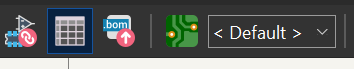
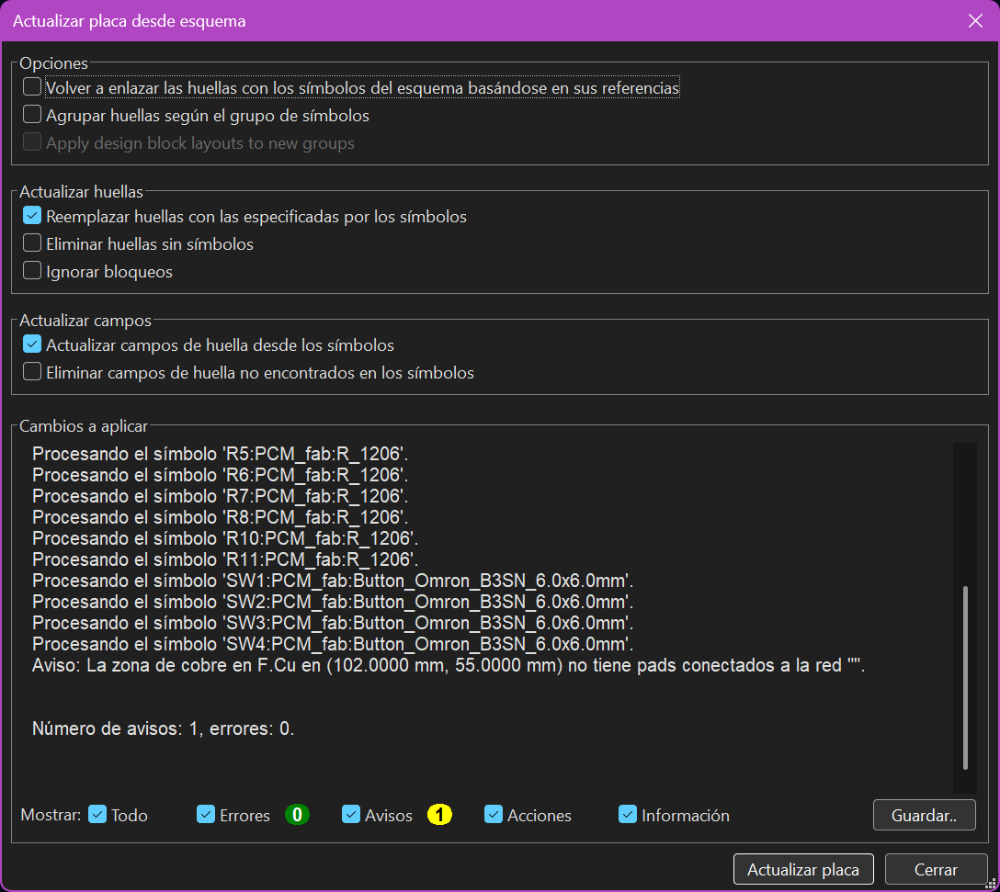
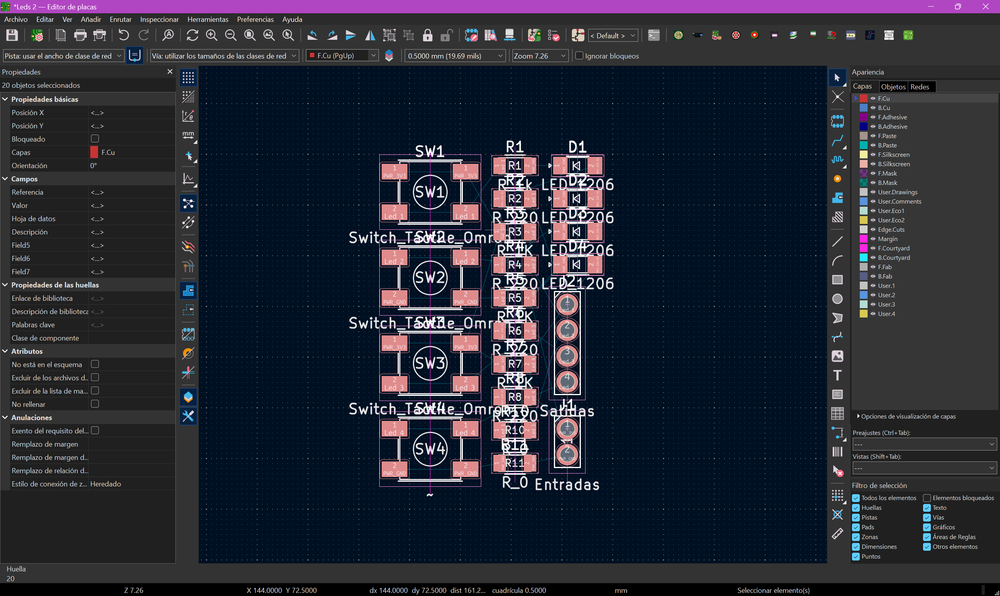
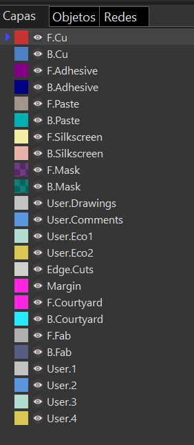
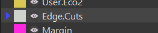
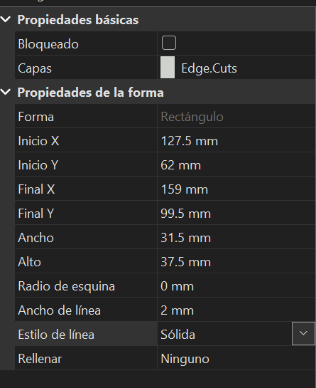
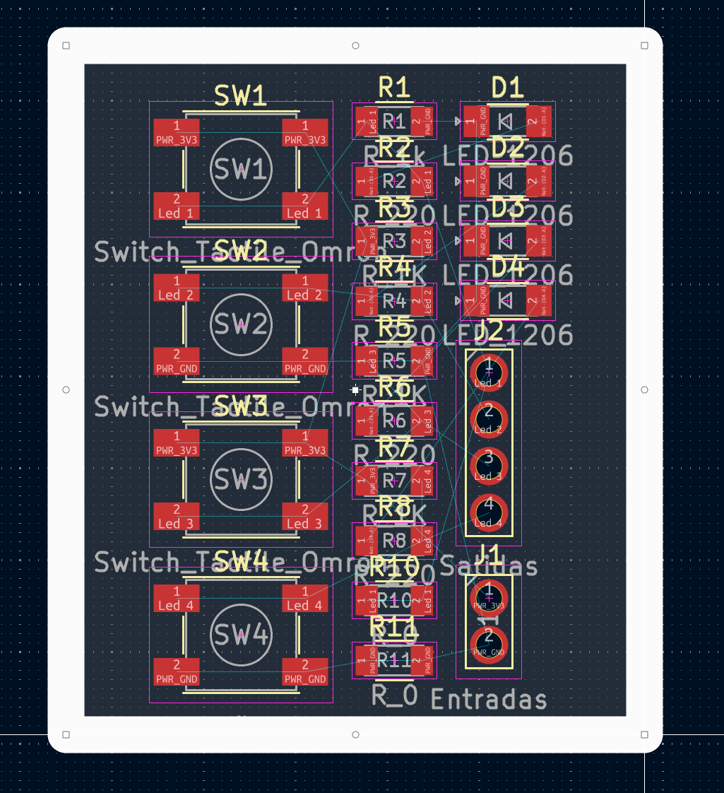
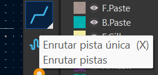
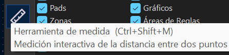

# Editor de Placas (PCB Layout)

Una vez que el diseño lógico ha sido validado en el esquemático, el siguiente paso crítico en nuestro flujo de trabajo es la traducción de este circuito a su forma física. En esta sección documentamos la importación de huellas (footprints), la definición del área de trabajo y la preparación para el ruteo.

## 1. Transición al Entorno de PCB

Para comenzar con el diseño físico, utilizamos el botón **Abrir editor de placas** ubicado en la barra de herramientas superior del Eeschema.

*Icono de acceso al editor de PCB (Pcbnew).*

!!! warning "Importante: Gestión del Proyecto"
    Es fundamental realizar este paso con la ventana principal del **Proyecto de KiCad** abierta en segundo plano. Si se abre el editor de placas de manera independiente, el software perderá el enlace con el esquemático, imposibilitando la sincronización de componentes y arrojando errores de conectividad al intentar actualizar.

## 2. Sincronización de Componentes

Con el editor de placas abierto, procedemos a importar los componentes lógicos a su representación física. Esto se logra ejecutando la herramienta **Actualizar placa desde esquema** (atajo de teclado `F8`).

*Gestor de actualización. Aquí verificamos que se procesen los símbolos sin errores.*

Al aplicar los cambios, las huellas de los componentes aparecerán agrupadas. En este punto, es visible una red de líneas delgadas que interconectan los pines; a este conjunto de guías se le conoce como **Ratsnest** (nido de ratas), el cual nos indica el orden, la topología y el destino exacto de cada conexión.

*Disposición inicial de los componentes interconectados por el ratsnest.*

## 3. Configuración de Capas de Trabajo

Antes de iniciar el trazado de pistas o contornos, debemos comprender el apilamiento de capas (Layer Stackup). Dado que el diseño actual es una placa de cara simple (una sola capa de cobre), todo nuestro trabajo conductivo se realizará en la capa **F.Cu** (Front Copper / Cobre Frontal).

*Gestor de capas posicionado en la capa principal de cobre (F.Cu).*

## 4. Delimitación del Contorno (Edge.Cuts)

Toda PCB necesita un límite físico definido para que la máquina CNC o el fabricante sepa por dónde cortar la placa terminada. Para trazar este límite, debemos cambiar nuestra capa activa a **Edge.Cuts** (Cortes de borde).

*Capa dedicada exclusivamente a la geometría del corte.*

Utilizando la herramienta de formas (Cuadrado/Rectángulo), trazamos un perímetro que encapsule todos nuestros componentes. Para darle mayor robustez visual al diseño y evitar problemas de tolerancias durante el corte, ajustamos las propiedades de la forma asignándole un **ancho de línea de 2 mm**.

*Ajuste de parámetros geométricos y grosor de línea del borde.*

*Contorno de la PCB delimitando exitosamente el área de trabajo física.*

## 5. Herramientas Esenciales para la Siguiente Fase

Para las etapas de distribución y enrutamiento, nos apoyaremos fuertemente en dos herramientas de la barra lateral izquierda:

*   **Enrutar pistas (X):** La herramienta principal que nos permitirá convertir las líneas virtuales del ratsnest en pistas reales de cobre.

*   **Herramienta de medida (Ctrl+Shift+M):** Crucial para verificar tolerancias, separaciones mínimas entre componentes y confirmar las dimensiones físicas reales de la placa.

---
