# :material-draw: Diseño del Esquemático

Bienvenidos a la primera fase técnica de nuestro proyecto. En esta sección, el **KiCad Squad** documentará paso a paso el proceso y las herramientas utilizadas para construir nuestro diagrama esquemático inicial.

El objetivo de esta etapa es definir la lógica de nuestro circuito, configurar el entorno con las librerías necesarias y establecer las conexiones eléctricas de forma estructurada.

---

## :material-clipboard-list-outline: Lista de Componentes Clave (BOM)

Antes de comenzar el ruteo, definimos los componentes principales que integrarán esta etapa del diseño:

| Componente | Símbolo KiCad | Huella (Footprint) | Cantidad | Función Principal |
| :--- | :--- | :--- | :---: | :--- |
| **Diodo LED** | `LED_1206` | `PCM_fab:LED_1206` | 4 | Indicador visual de estado |
| **Resistencia 220Ω** | `R` | `PCM_fab:R_1206` | 4 | Limitador de corriente para LEDs |
| **Resistencia 1kΩ** | `R` | `PCM_fab:R_1206` | 4 | Resistencias Pull-down / Configuración |
| **Pines de Conexión** | `Conn_01x04` | `PinHeader_1x04` | 2 | Puertos de entrada/salida (Switches y LEDs) |

---

## :material-cog-play-outline: Proceso de Diseño Paso a Paso

### 1. Creación y Apertura del Proyecto
Comenzamos inicializando nuestro entorno de trabajo. Abrimos KiCad y cargamos nuestro archivo de proyecto principal (`.kicad_pro`). 

!!! tip "Buena Práctica de Ingeniería"
    Mantener todos los archivos (`.kicad_sch`, `.kicad_pcb`) estrictamente dentro de su carpeta raíz evita la pérdida de enlaces a librerías locales o rutas relativas rotas al compartir el proyecto.

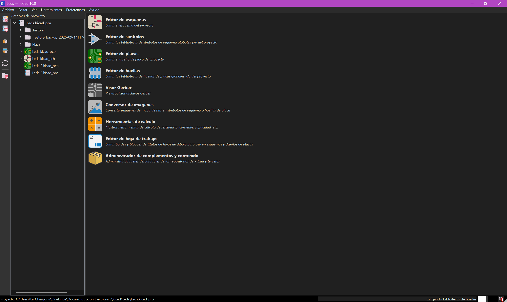
*Interfaz principal de KiCad con el proyecto cargado.*

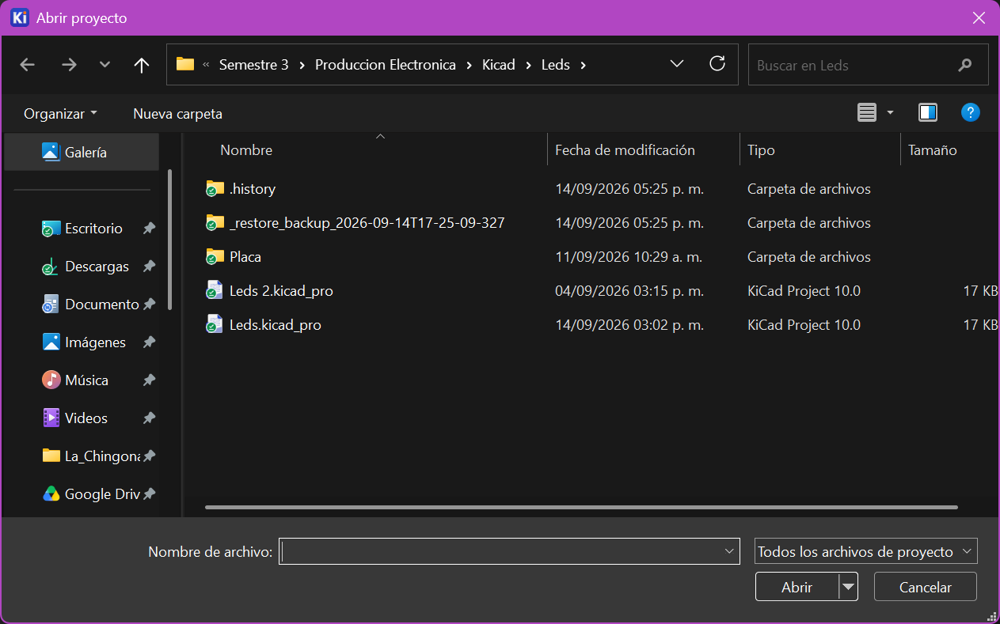
*Directorio raíz del proyecto asegurando la correcta ubicación de los archivos.*

### 2. Instalación de Librerías Externas (FabLib)
Para estandarizar nuestros componentes, abrimos el **Administrador de complementos y contenido** desde la pantalla principal.

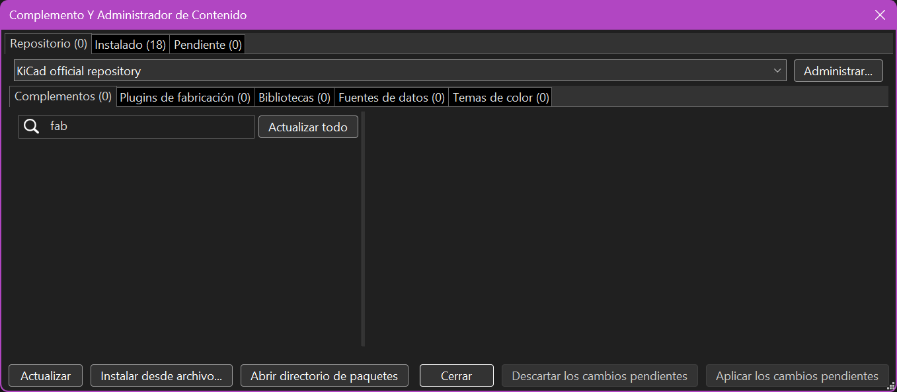
*Búsqueda de librerías en el gestor de paquetes de KiCad.*

Buscamos e instalamos la librería **KiCad FabLib**, la cual nos proporciona huellas y símbolos compatibles con inventarios estándar de fabricación.

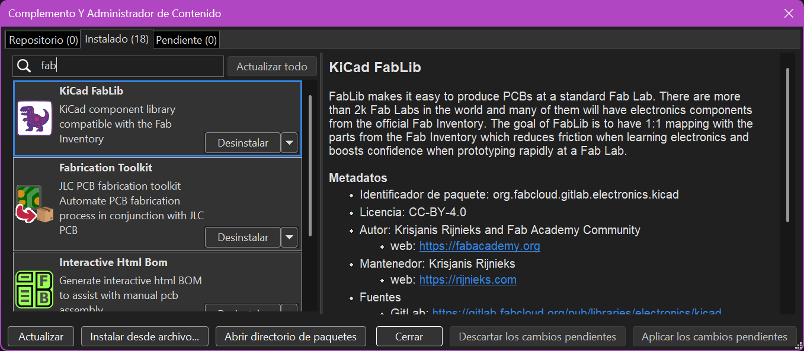
*Confirmación de la librería FabLib instalada.*

### 3. Acceso al Entorno de Diseño
Una vez configuradas las librerías, abrimos el entorno de diseño lógico seleccionando el **Editor de esquemas** en el menú principal.

!!! info "Atajo de Teclado"
    Presionar `Ctrl + E` en la pantalla principal abre directamente el Eeschema, agilizando el flujo de trabajo.

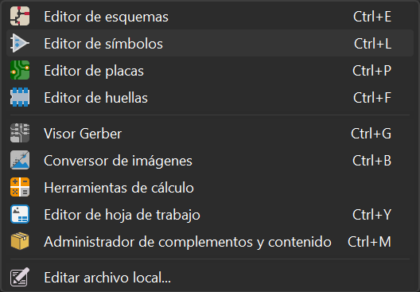
*Accediendo al Eeschema.*

### 4. Selección y Colocación de Componentes
Dentro del editor, presionamos la tecla `A` para abrir la herramienta **Colocar símbolos**. 

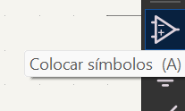
*Icono de la herramienta para agregar componentes.*

Seleccionamos un `LED_1206`, asegurándonos de utilizar el componente proveniente de nuestra librería recién instalada.

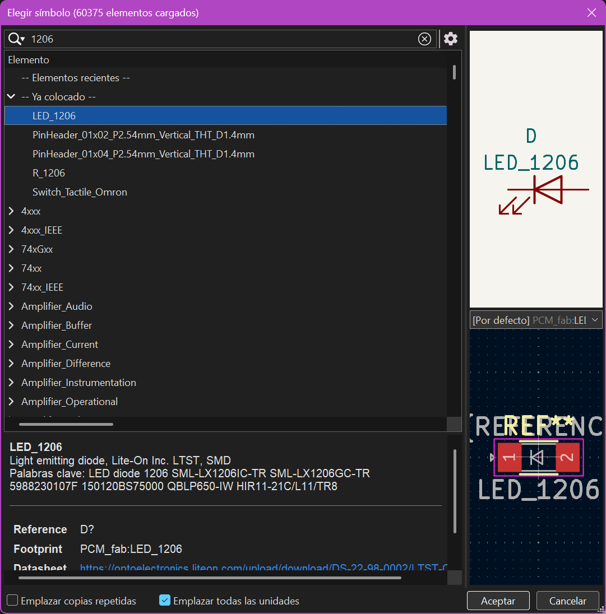
*Ventana de selección de símbolos ubicando el LED SMD 1206.*

### 5. Configuración de Alimentación
Todo circuito requiere referencias estables. Presionando la tecla `P` accedimos a los **símbolos de alimentación**.

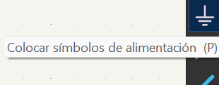
*Icono de la herramienta para agregar puertos de energía.*

Elegimos el símbolo `PWR_3V3` para establecer la línea de voltaje positivo que alimentará nuestro sistema.

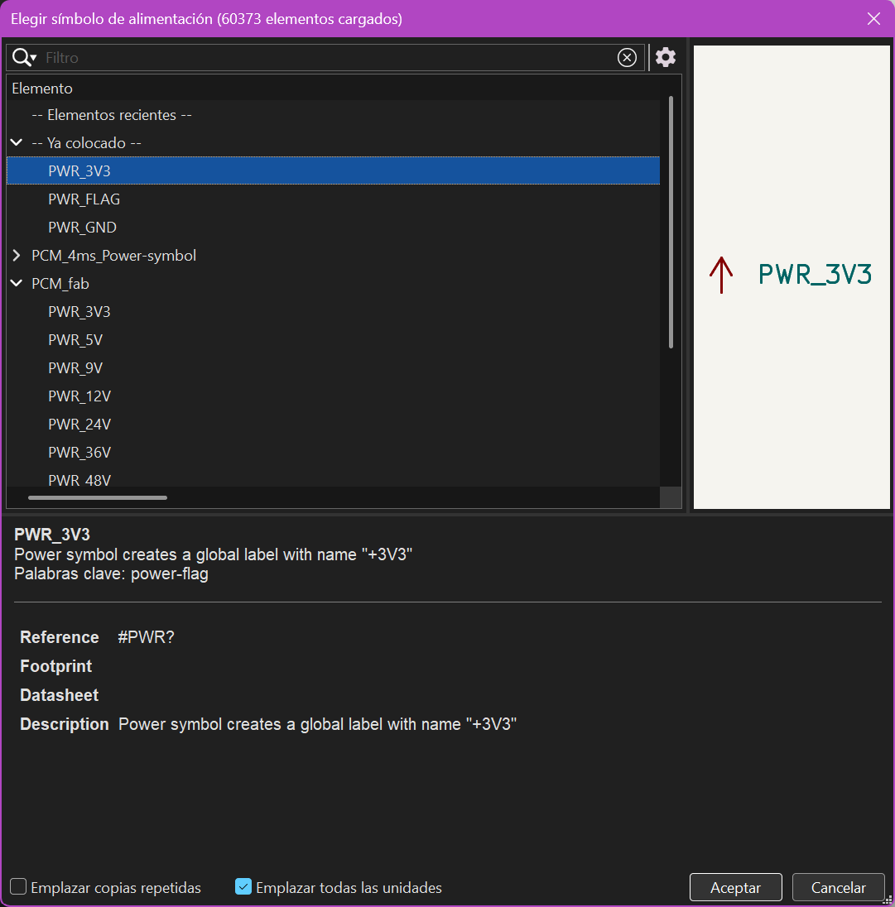
*Seleccionando la etiqueta global de alimentación a 3.3V.*

### 6. Ruteo Lógico y Conexiones (Wiring)
Con los símbolos en la hoja, utilizamos la herramienta **Dibujar cables** (tecla `W`) para interconectar los pines y cerrar los lazos del circuito.

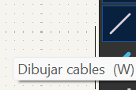
*Icono de la herramienta de cableado.*

### 7. Organización y Legibilidad del Diagrama
Un buen esquemático debe ser fácil de interpretar. En lugar de trazar líneas largas que saturen la pantalla, implementamos **Etiquetas de Red (Net Labels)**.

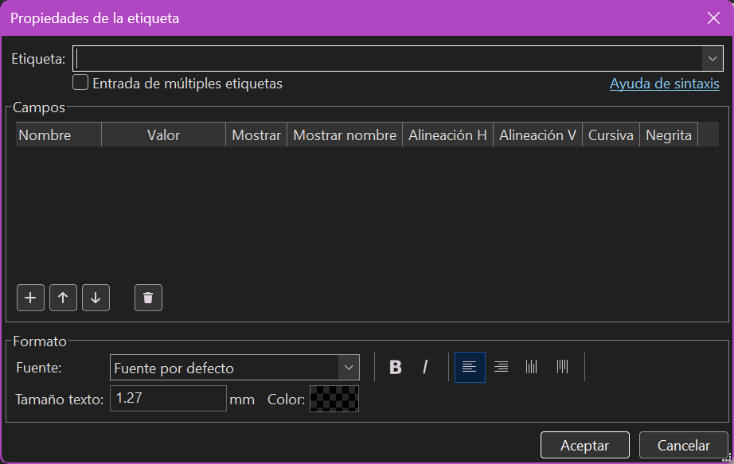
*Configuración de etiquetas de red para organizar las conexiones lógicas.*

Utilizamos las herramientas gráficas de **Texto** y **Dibujar rectángulos** para seccionar el diagrama.

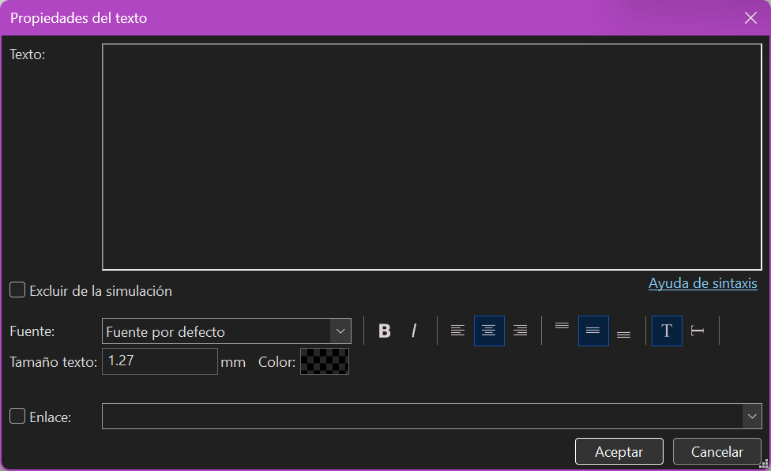
*Herramienta de texto para nombrar los módulos del circuito.*

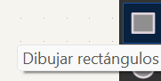
*Icono de la herramienta gráfica para crear bloques visuales.*

Con esto, separamos el diseño en bloques funcionales claros: un bloque de "Pines" para las E/S y un bloque de "Switches".

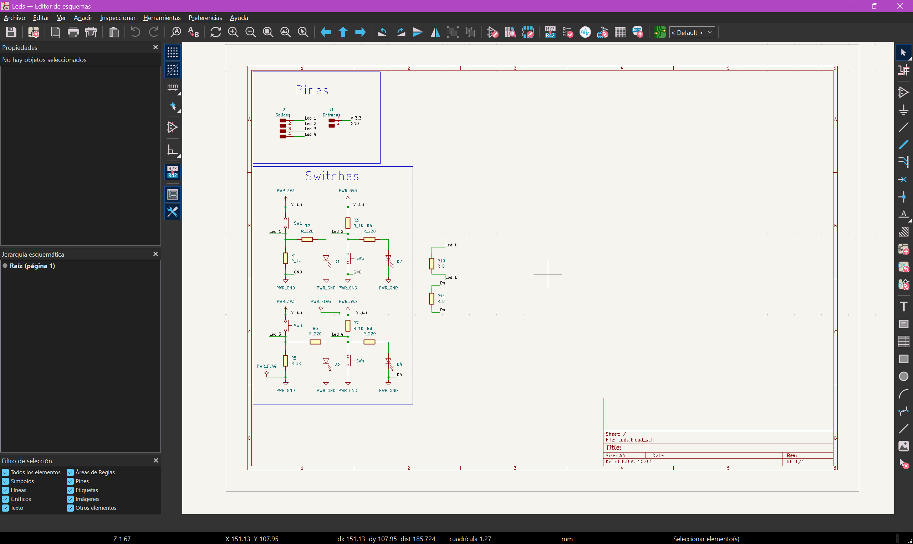
*Vista general del esquemático, organizado por bloques y etiquetas.*

En el siguiente detalle se observa cómo las etiquetas (`V 3.3`) conectan virtualmente la alimentación a los componentes, eliminando la necesidad de cables cruzados.

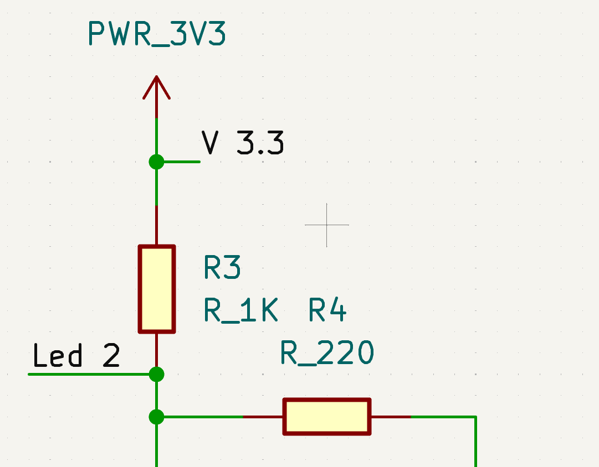
*Bloque de LEDs mostrando las resistencias y referencias.*

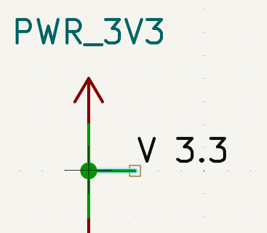
*Detalle de la conexión virtual mediante etiquetas de red.*

### 8. Configuración de Parámetros (Valores y Huellas)
Haciendo doble clic sobre los componentes (o tecla `E`), ingresamos a sus propiedades para definir sus valores eléctricos (`220`, `1k`) y vincular la huella física correcta desde FabLib.

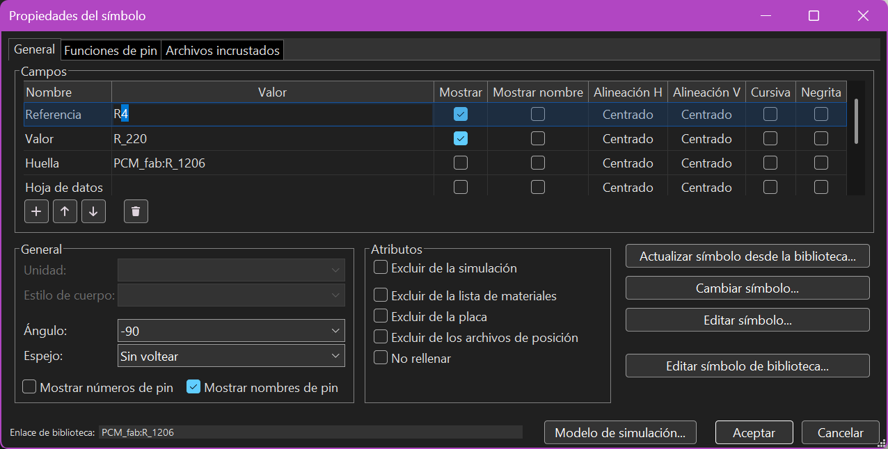
*Asignando valores paramétricos y Footprints a los resistores.*

### 9. Verificación de Reglas Eléctricas (ERC)
Como control de calidad final, ejecutamos el **ERC**. Esta herramienta escanea el esquemático en busca de pines flotantes o conflictos de alimentación.

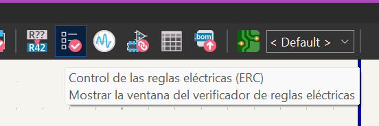
*Ejecución del verificador en la barra superior.*

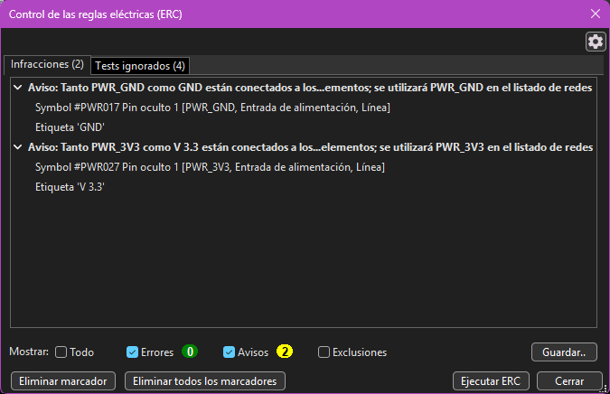
*Reporte final del analizador.*

!!! success "Validación Exitosa y Checklist"
    El reporte arrojó **0 Errores**, confirmando un diseño estable. (Las dos advertencias mostradas son meramente informativas por el uso de múltiples etiquetas para la misma red, una práctica común y segura).

---

### :material-check-all: Checklist de la Fase 1

- [x] Configuración del proyecto y entorno de KiCad.
- [x] Instalación de librerías de fabricación (FabLib).
- [x] Ruteo lógico y asignación de etiquetas de red.
- [x] Asignación de valores y *Footprints*.
- [x] Aprobación del Control de Reglas Eléctricas (ERC).

**¡El esquemático está validado y listo para pasar al Editor de Placas (Layout)!**
