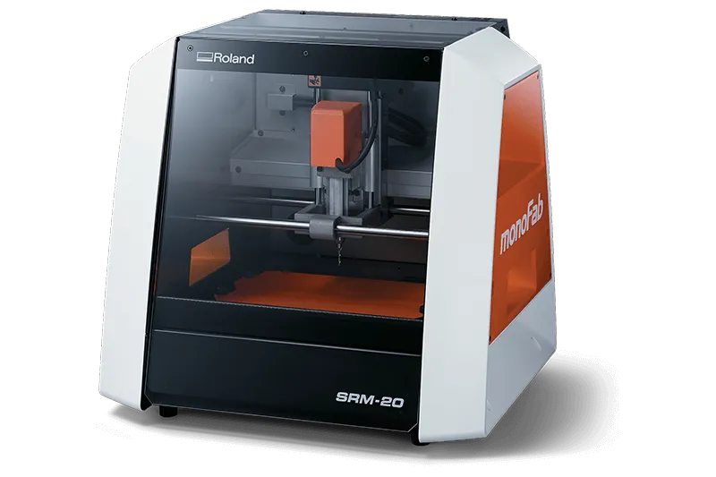

  <!-- Logo de tu equipo -->
  
  
  <!-- Logo de KiCad actualizado a tu archivo local -->
  

# Documentación de Diseño de PCB

<!-- BARRA LATERAL FLOTANTE DE ICONOS -->

  
  
  
  
  
  

<!-- FIN BARRA LATERAL -->

Bienvenido a la bitácora del proyecto de diseño de nuestra placa de circuito impreso (PCB). Este sitio documenta el flujo de trabajo realizado en **KiCad**.

  <a href="https://www.kicad.org/download/" target="_blank" class="btn-descarga">
    📥 Descargar KiCad Oficial
  </a>

## 🎬 Introducción al Entorno (Curso)

Si apenas estás comenzando, te recomendamos ver el primer episodio del curso **KiCad desde Cero** (por *Easy Learning*). En esta vista previa podrás familiarizarte con el entorno de trabajo antes de replicar nuestra documentación:

  <iframe style="position: absolute; top: 0; left: 0; width: 100%; height: 100%;" src="https://www.youtube.com/embed/d3H3tfU4zBI" title="KiCad desde Cero - Entorno" frameborder="0" allow="accelerometer; autoplay; clipboard-write; encrypted-media; gyroscope; picture-in-picture" allowfullscreen></iframe>

---

## Fases del Proyecto

-    **[1. Esquemático](desarrollo-pcb.md)**
    
    ---
    
    Documentación del diagrama lógico, selección de componentes y cableado.
    
    [Ver documentación ➔](desarrollo-pcb.md)

-    **[2. Editor de Placas (Layout)](desarrollo-pcb.md#2-editor-de-placas-pcb-layout)**
    
    ---
    
    Distribución de huellas, ruteo físico de pistas y zonas de cobre.
    
    [Ver documentación ➔](desarrollo-pcb.md#2-editor-de-placas-pcb-layout)

-    **[3. Manufactura CAM (Mods CE)](desarrollo-pcb.md#3-manufactura-cam-y-generacion-de-trayectorias-mods-ce)**
    
    ---
    
    Generación de trayectorias (G-Code/Toolpaths) para la fresadora CNC SRM-20.
    
    [Ver documentación ➔](desarrollo-pcb.md#3-manufactura-cam-y-generacion-de-trayectorias-mods-ce)

-   :material-book-open-variant: **[4. Recursos y Referencias](recursos.md)**
    
    ---
    
    Material de referencia, repositorios y guías útiles para el proyecto.
    
    [Ver recursos ➔](recursos.md)

