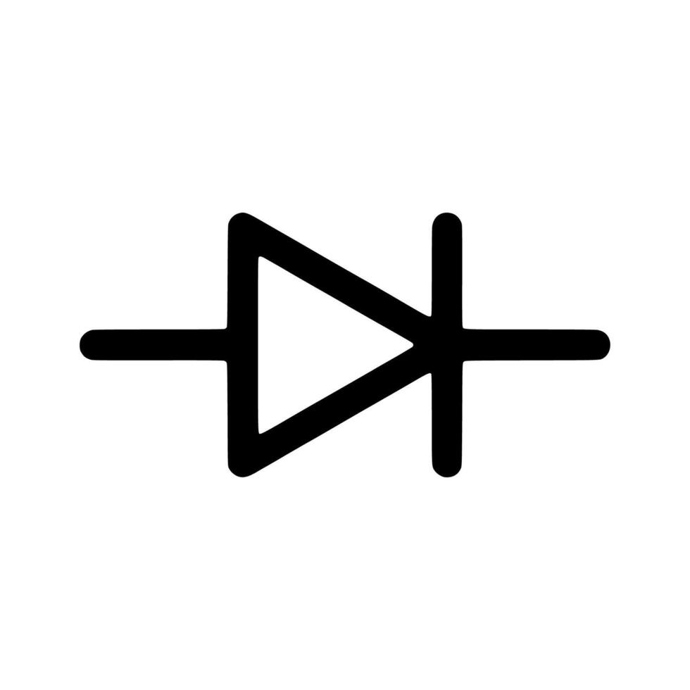

  <!-- Logo de tu equipo -->
  
  
  <!-- Logo de KiCad actualizado a tu archivo local -->
  

# Documentación de Diseño de PCB

Bienvenido a la bitácora del proyecto de diseño de nuestra placa de circuito impreso (PCB). Este sitio documenta el flujo de trabajo realizado en **KiCad**.

  <a href="https://www.kicad.org/download/" target="_blank" class="btn-descarga">
    📥 Descargar KiCad Oficial
  </a>

## 🎬 Introducción al Entorno (Curso)

Si apenas estás comenzando, te recomendamos ver el primer episodio del curso **KiCad desde Cero** (por *Easy Learning*). En esta vista previa podrás familiarizarte con el entorno de trabajo antes de replicar nuestra documentación:

  <iframe style="position: absolute; top: 0; left: 0; width: 100%; height: 100%;" src="https://www.youtube.com/embed/d3H3tfU4zBI" title="KiCad desde Cero - Entorno" frameborder="0" allow="accelerometer; autoplay; clipboard-write; encrypted-media; gyroscope; picture-in-picture" allowfullscreen></iframe>

---

## Fases del Proyecto

-    **[1. Esquemático](esquematico.md)**
    
    ---
    
    Documentación del diagrama lógico, selección de componentes y cableado.
    
    [Ver documentación ➔](esquematico.md)

-    **[2. Editor de Placas (Layout)](editor-placas.md)**
    
    ---
    
    Proceso de ruteo, distribución de huellas y diseño físico de la PCB.
    
    [Ver documentación ➔](editor-placas.md)

-   ⚙️ **[3. Mods CE](mods-ce.md)**
    
    ---
    
    Modificaciones aplicadas, correcciones y consideraciones técnicas.
    
    [Ver documentación ➔](mods-ce.md)

-   📚 **[4. Recursos](recursos.md)**
    
    ---
    
    Material de referencia, hojas de datos y guías para el manejo de KiCad.
    
    [Ver documentación ➔](recursos.md)

---

## Nuestro Equipo: KiCad Squad

Proyecto de Electrónica - IBERO Puebla

<!-- Contenedor del equipo ajustado para 4 personas -->

  
  <!-- Carlos -->
  

    
    <h3 style="margin-bottom: 0; font-size: 1.1em;">Carlos Alberto Vázquez Peraza</h3>
    
Ingeniería de Diseño

  

  <!-- Luis -->
  

    
    <h3 style="margin-bottom: 0; font-size: 1.1em;">Luis Ernesto Tamez Velásquez</h3>
    
Desarrollo y Documentación

  

  <!-- Juan Manuel -->
  

    
    <h3 style="margin-bottom: 0; font-size: 1.1em;">Juan Manuel Gaona Serrano</h3>
    
Integración y Pruebas

  

  <!-- Brandon -->
  

    
    <h3 style="margin-bottom: 0; font-size: 1.1em;">Brandon Saúl Ruvalcaba Pérez</h3>
    
Control de Calidad

  

