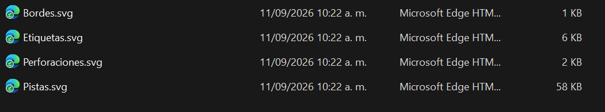
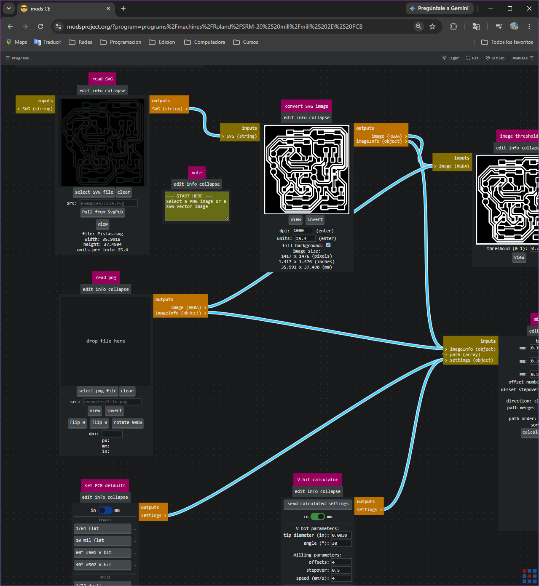
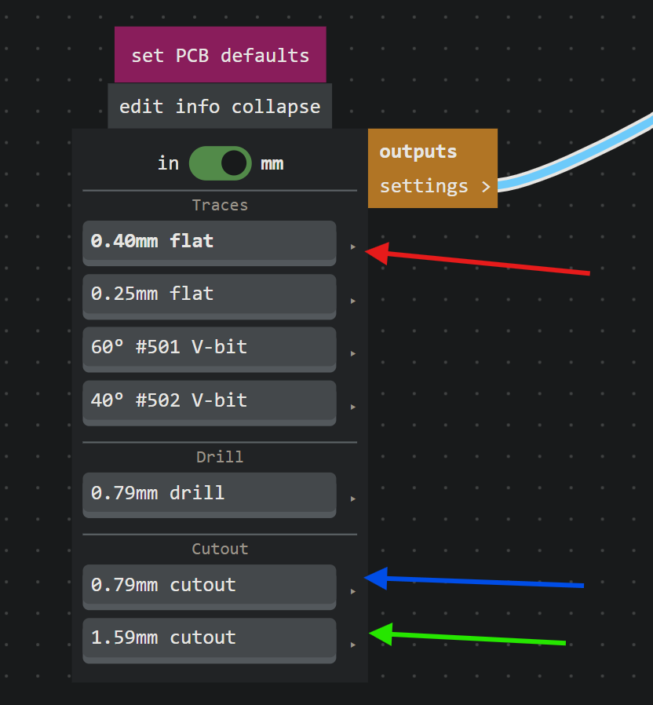
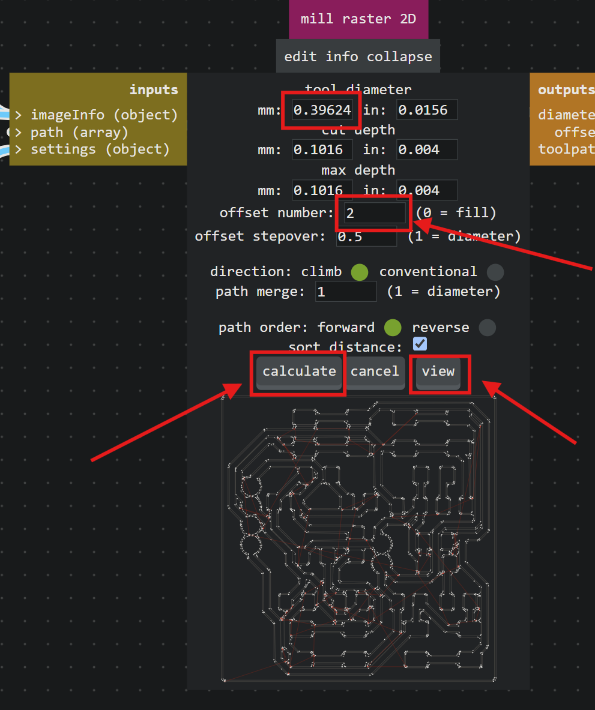
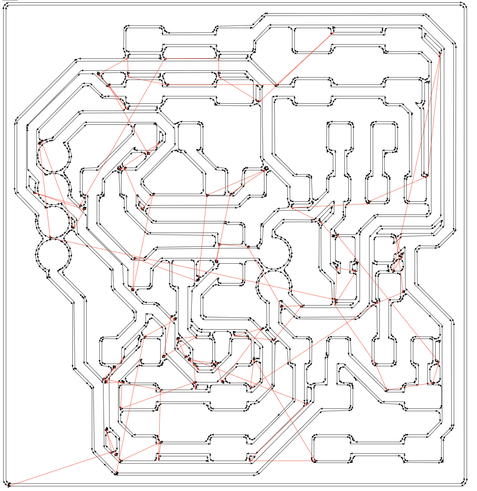
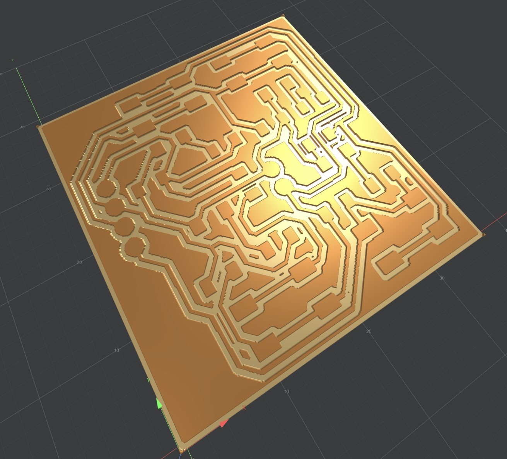
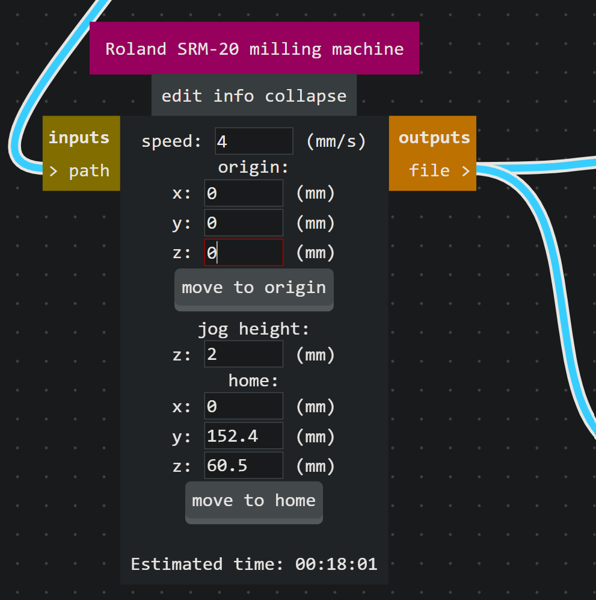

# Preparación de Archivos con Mods CE

!!! abstract "Objetivo de esta fase"
    Una vez generados los archivos de las capas de nuestra placa en KiCad, es necesario "traducirlos" a un formato (G-Code/Toolpaths) que la fresadora CNC **Roland Monofab (SRM-20)** pueda interpretar para realizar el corte físico.

Para realizar esta conversión utilizaremos **Mods CE** (Community Edition), una plataforma basada en navegador ideal para la generación de trayectorias de fresado de PCBs.

---

## 1. Archivos Base (SVG)

El proceso comienza exportando las capas necesarias desde el editor de KiCad en formato vectorial (`.svg`). Debemos tener listos los archivos correspondientes a las **pistas**, **perforaciones**, **bordes** y **etiquetas** (opcional).

---

## 2. Acceso y Configuración del Entorno Mods CE

Para configurar nuestro espacio de trabajo, seguimos esta ruta de inicialización:

1. Ingresamos a la página oficial de [Mods CE](https://modsproject.org).
2. En la interfaz principal (identificable por el logo de la carita feliz en la pestaña), hacemos clic derecho o buscamos el menú de opciones en la esquina para abrir los **Programs**.
3. Navegamos hacia la sección de máquinas, buscamos **Roland SRM-20** y seleccionamos la opción **mill 2D PCB**.

  
  
  

Al cargar el programa, se desplegará una red de nodos interconectados (diagrama de flujo de datos) que procesarán nuestro archivo desde el SVG hasta el archivo de corte de la máquina.

---

## 3. Configuración de Pistas (Traces)

Comenzaremos procesando el archivo de las pistas (`Pistas.svg`). En el nodo de entrada, cargamos nuestro archivo SVG. A continuación, configuramos los parámetros de la herramienta:

!!! tip "Parámetros de la Broca"
    Para el fresado de las pistas utilizaremos una broca plana estándar. En el nodo de configuración (*set PCB defaults*), seleccionamos **0.40mm flat** (lo que equivale aproximadamente a 1/64 de pulgada).

### Ajuste de Pasadas (Offsets)
En el nodo **mill raster 2D**, definiremos cuánto material queremos remover alrededor de cada pista:

* **Offset number:** Lo configuramos en `4`. Esto indica que el taladro realizará cuatro pasadas concéntricas alrededor de las pistas para asegurar un buen aislamiento de cobre.
* Una vez configurado, hacemos clic en el botón **Calculate**.

---

## 4. Visualización y Renderizado

Al presionar *Calculate*, Mods CE generará el plano de trayectorias de la herramienta (toolpath). 

Podemos hacer clic en el botón **View** para obtener un renderizado 3D de cómo quedará la placa físicamente. 

!!! warning "Interpretación del Renderizado"
    En el renderizado 3D, **el área oscura representa el cobre que será removido** por la fresadora, mientras que el área clara e intacta representa nuestras pistas y pads eléctricos. 

---

## 5. Origen y Velocidad (Nodo SRM-20)

El último paso antes de exportar el archivo es configurar los parámetros físicos de la máquina en el nodo final **Roland SRM-20 milling machine**:

* **Speed (Velocidad):** Ajustamos la velocidad de fresado a `4 mm/s` para evitar rupturas en la broca y asegurar cortes limpios.
* **Origin (Origen de coordenadas):**
    * Se configura en **X: 0, Y: 0, Z: 0** para la fabricación de una placa individual principal. 
    * *Nota:* Si se requiere producir múltiples placas (panelización) en el mismo bloque de cobre, este origen en los ejes X o Y deberá desfasarse correspondientemente.

Una vez verificados estos datos, el archivo estará listo para ser guardado y enviado al software de control de la Monofab (VPanel).

## 6. Guardado y Organización de Archivos

Para finalizar la configuración de las pistas, buscamos el nodo **save file**. Al hacer clic en el botón inferior, el navegador descargará automáticamente un archivo con la extensión `.rml` (Roland Machine Language). 

!!! warning "Importante: Renombrar los archivos"
    Por defecto, Mods CE guarda todos los archivos bajo el nombre genérico `SVG image.rml`. Es **crucial** ubicar el archivo descargado inmediatamente y renombrarlo (por ejemplo, a `1_Pistas.rml`) para mantener una organización estricta y evitar confusiones fatales al momento de operar la fresadora.

  
  

---

## 🛠️ Solución de Problemas Frecuentes

Durante el procesamiento de las pistas, pueden surgir un par de complicaciones comunes que tienen solución rápida:

1. **Áreas de corte invertidas:** Si al ver el renderizado 3D notas que la máquina cortará el cobre que querías conservar (dejando expuesto lo que querías quitar), dirígete al nodo **convert SVG image** y haz clic en el botón **invert**. Esto corregirá la polaridad de la imagen.
2. **Errores en el contorno:** Si la placa presenta bordes irregulares o el SVG no fue interpretado correctamente desde KiCad, la mejor práctica es abrir el archivo original en **Inkscape** para corregir y unificar los vectores antes de subirlo a Mods CE.

  

---

## 7. Configuración de Perforaciones (Drills)

Una vez asegurado el archivo de las pistas, repetiremos el proceso para las perforaciones cargando el archivo `Perforaciones.svg`. La lógica de los nodos es idéntica, pero los parámetros de corte cambian.

1. **Herramienta:** En el nodo *set PCB defaults*, seleccionamos **0.79mm drill** (que corresponde a nuestra broca de 0.8 mm).
2. **Pasadas (Offsets):** En el nodo de cálculo (*mill raster 2D*), configuramos el **offset number** en `1`. A diferencia de las pistas, aquí solo necesitamos que la broca baje exactamente en el centro una sola vez por cada agujero.
3. Hacemos clic en **Calculate** y luego en **View** para verificar que la posición de los agujeros coincida perfectamente con los pads de nuestro diseño.

  
  
  
  

  
   <em style="color: #888;">Renderizado 3D de las perforaciones calculadas.</em>

---

## 8. Parámetros Críticos y Guardado (Perforaciones)

!!! danger "Velocidad de Corte Crítica (Speed)"
    En el nodo final **Roland SRM-20 milling machine**, es **obligatorio reducir la velocidad a `0.3 mm/s`**. Las brocas de perforación de 0.8 mm son extremadamente frágiles; si la máquina intenta taladrar muy rápido o entra al material de forma inestable, la broca se romperá instantáneamente.

En este mismo nodo, podemos observar el tiempo estimado de trabajo (*Estimated time*) en la parte inferior, lo cual es muy útil para planificar el uso de la máquina en el laboratorio.

Finalmente, nos dirigimos al nodo **save file**, hacemos clic para descargar, y renombramos inmediatamente este nuevo archivo (por ejemplo, a `2_Perforaciones.rml`).

  
  

