## 4. Operación de la Fresadora Monofab (SRM-20)

La culminación de nuestro diseño se materializa en el mecanizado de la placa. En esta sección documentamos los procedimientos operativos estándar, la calibración de herramientas y las normativas de seguridad para operar la fresadora CNC Roland Monofab SRM-20.

---

### 4.1 Preparación del Material Base y Seguridad

El lienzo de nuestro proyecto es una placa de revestimiento de cobre (Copper Clad). En la industria existen principalmente dos variantes según su material base: las compuestas por papel impregnado (fenólicas) y las de fibra de vidrio (FR4). 

| Superficie de Cobre | Material Base (Fenólico/FR4) |
| :---: | :---: |
| 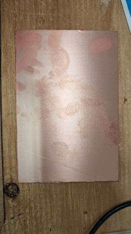{ width="300" } | 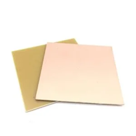{ width="300" } |

!!! danger "Equipo de Protección Personal (EPP)"
    El mecanizado de estas placas libera micropartículas de fibra de vidrio y resinas sintéticas. Es **estrictamente obligatorio** el uso de cubrebocas y lentes de seguridad (gafas) durante toda la manipulación, ya que la inhalación de este polvo residual es altamente perjudicial para la salud respiratoria.

Para proteger la base metálica de la máquina durante cortes profundos (contornos), emplearemos una **placa de sacrificio**. La placa de cobre virgen se fijará directamente sobre ella, asegurando que esté perfectamente alineada.

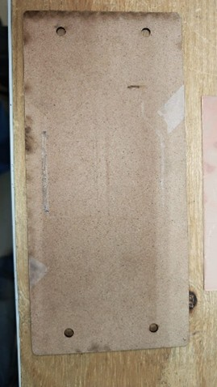{ width="400" }
*Figura 4.1: Placa de sacrificio empleada para evitar daños en la cama de la CNC.*

---

### 4.2 Selección de Herramientas de Corte (Fresas y Brocas)

El proceso de maquinado consta de tres etapas lógicas, cada una requiere una herramienta con geometría específica:

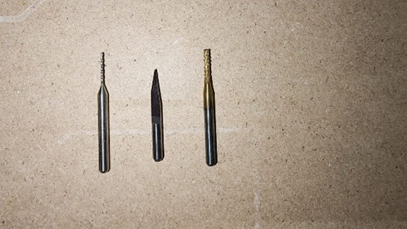{ width="400" }
*Figura 4.2: Juego de herramientas utilizadas en el proceso CAM.*

1. **Broca de 0.8 mm (Perforaciones):** Herramienta destinada exclusivamente a taladrar los agujeros pasantes para componentes THT. Dada su extrema fragilidad, es crítico configurar su velocidad de avance a máximo `0.3 mm/s`. Los movimientos manuales con esta broca deben ser sumamente suaves.
2. **Fresa de Grabado en V (Pistas):** Herramienta principal de desgaste que aísla las pistas eléctricas. Es vital inspeccionar visualmente que la punta no esté achatada o desgastada antes de iniciar. 
3. **Fresa de Contorno (End Mill):** Herramienta cilíndrica robusta que se utilizará en la etapa final para cortar el perímetro y desprender nuestra PCB de la placa matriz.

| Broca 0.8mm (Drill) | Fresa en V (Engraving) | Fresa Contorno (Cutout) |
| :---: | :---: | :---: |
| 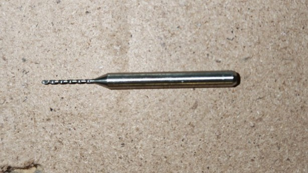{ width="200" } | 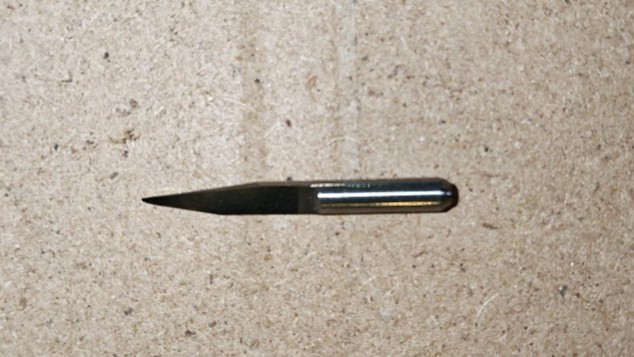{ width="200" } | 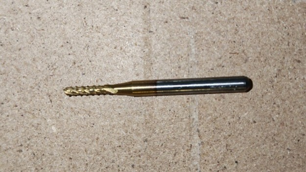{ width="200" } |

---

### 4.3 Montaje y Fijación de la Placa

La precisión del ruteo depende enteramente de la inmovilidad de la pieza. Posicionamos la placa de cobre sobre la de sacrificio asegurando su adherencia. 

Como medida de seguridad adicional y para absorber vibraciones, aplicamos cinta de carrocero (Masking Tape) en todo el perímetro, garantizando que los bordes no se levanten por ninguna parte. Finalmente, fijamos todo el bloque a la cama de la máquina utilizando los 4 pernos hexagonales, aplicando un torque firme.

| Refuerzo Perimetral | Sujeción Mecánica |
| :---: | :---: |
| 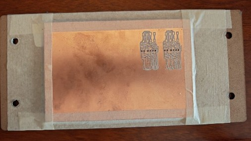{ width="220" } | 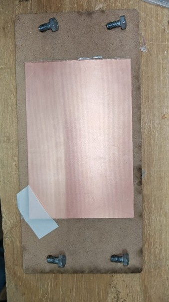{ width="220" } |

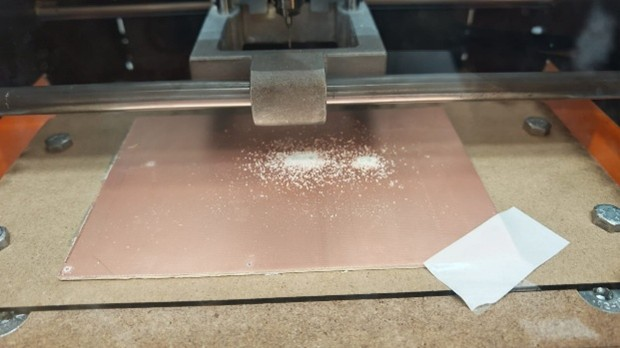{ width="500" }
*Figura 4.3: Vista del ensamble físico asegurado dentro de la fresadora SRM-20.*

---

### 4.4 Interfaz de Control: VPanel for SRM-20

El control cinemático de la fresadora se realiza mediante el software VPanel. Para que la interfaz establezca comunicación, el controlador (Driver) del equipo debe estar previamente instalado. 

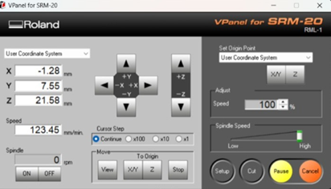{ width="600" }
*Figura 4.4: Pantalla principal del software de operación VPanel.*

#### Navegación y Calibración Espacial
La interfaz se divide en controles críticos (resaltados por colores para su análisis):
*   **Controles de Ejes (Azul y Rojo):** El recuadro azul controla los ejes cartesianos horizontales X/Y. El recuadro rojo controla el eje Z, ajustando la altura de la herramienta. 
*   **Resolución de Pasos (Verde):** Permite modular la agresividad del desplazamiento (`Continue`, `x100`, `x10`, `x1`). 

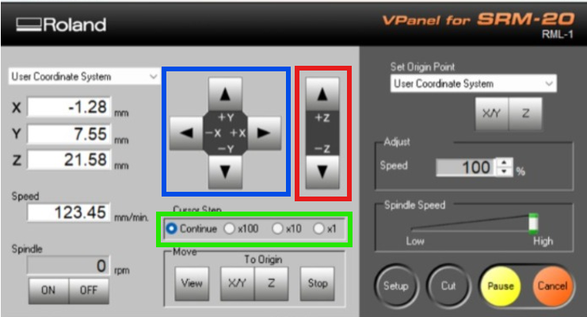{ width="600" }
*Figura 4.5: Mapeo de controles direccionales y escalas de resolución de pasos.*

#### Definición del Origen (Zeroing)
Una vez que el husillo se ha llevado al punto deseado en la placa, las coordenadas actuales se mostrarán en el recuadro naranja. Para indicar que este punto físico corresponde al `(0,0,0)`, utilizamos los botones del recuadro verde claro (`Set Origin Point`).

!!! warning "Procedimiento Crítico para Brocas de 0.8 mm"
    Al calibrar el eje Z para perforaciones, **el husillo (Spindle) debe estar encendido** (recuadro cian). 
    **El flujo correcto es:** Encender husillo ➔ Bajar hasta tocar el material ➔ Fijar Origen Z ➔ Subir eje Z ➔ Apagar husillo. 

| Panel de Origen y Husillo | Confirmación XY | Confirmación Z |
| :---: | :---: | :---: |
| 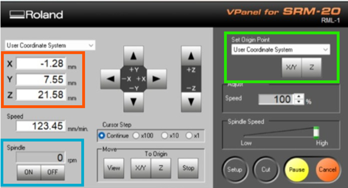{ width="220" } | 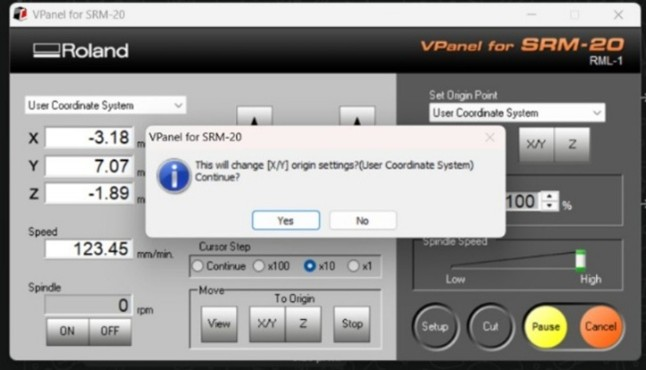{ width="220" } | 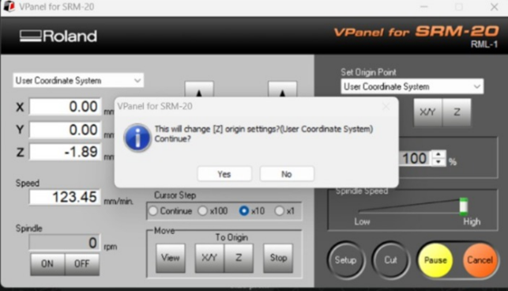{ width="220" } |

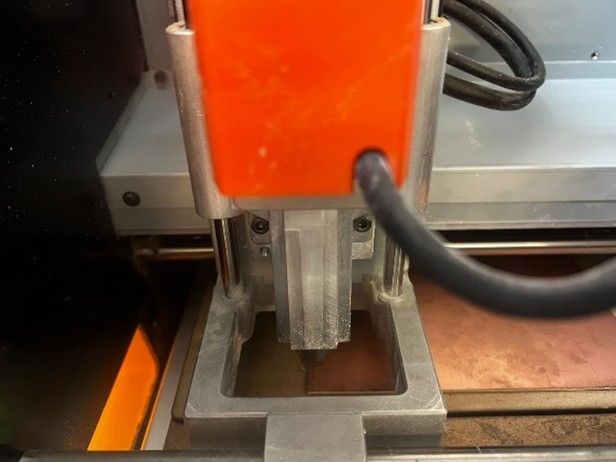{ width="400" }
*Figura 4.6: Perspectiva de la fresa posicionada y calibrada en su origen Cero absoluto.*

---

### 4.5 Ejecución del Corte y Gestión de Archivos

Con el origen definido, inicializamos la lectura del código G presionando el botón `Cut` (Círculo Verde). En la ventana emergente, agregamos nuestros archivos `.rml` generados en la etapa anterior. 

| Botones de Control de Corte | Gestor de Archivos (Output) |
| :---: | :---: |
| 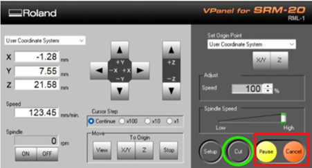{ width="300" } | 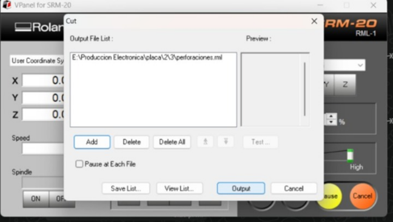{ width="300" } |

!!! danger "Protocolo de Aborto de Emergencia"
    Si durante el proceso se detecta una falla crítica, **NO se debe oprimir "Cancel" directamente**. 
    El protocolo correcto es: Primero oprimir **Pause (Amarillo)** para detener suavemente la inercia, y posteriormente **Cancel (Naranja)**.

---

### 4.6 Registros en Video del Maquinado

A continuación, se documenta el comportamiento visual y sonoro del equipo operando de manera estable en cada una de sus fases. Estos registros sirven como referencia paramétrica del correcto funcionamiento.

### 🎬 1. Proceso de Calibración
<iframe width="100%" height="450" src="https://www.youtube.com/embed/IyW2ds94XEg" frameborder="0" allowfullscreen style="border-radius: 8px;"></iframe>
*Comportamiento del equipo durante la fijación de origen.*

### 🎬 2. Corte de Perforaciones (Drills)
<iframe width="100%" height="450" src="https://www.youtube.com/embed/UbnT4TOCsE4" frameborder="0" allowfullscreen style="border-radius: 8px;"></iframe>
*Taladrado lento y preciso para pads THT.*

### 🎬 3. Fresado de Pistas (Traces)
<iframe width="100%" height="450" src="https://www.youtube.com/embed/9RfUi29YqvA" frameborder="0" allowfullscreen style="border-radius: 8px;"></iframe>
*Desgaste de cobre para aislamiento eléctrico.*

### 🎬 4. Corte de Contorno (Cutout)
<iframe width="100%" height="450" src="https://www.youtube.com/embed/hr0GlR7TEDo" frameborder="0" allowfullscreen style="border-radius: 8px;"></iframe>
*Corte perimetral profundo para desprendimiento.*

---

### 4.7 Tips y Recomendaciones Técnicas de Manufactura

!!! tip "Recomendaciones Operativas Comprobadas"
    *   **Calibración Dinámica de Pistas:** El método de la hoja de papel suele fallar porque asume que el material base es perfectamente plano. La técnica superior consiste en posicionar la herramienta levemente arriba, encender el maquinado y bajar en incrementos finos (Baby-stepping) hasta que comience a desprender material. 
    *   **Diagnóstico Sonoro y Visual:** Si la máquina emite mucho ruido, vibra excesivamente o expulsa una cantidad exagerada de viruta gruesa que opaca las pistas, significa que la profundidad Z es excesiva. 

Aplicando rigurosamente estas pautas, el fresado concluirá de manera óptima, arrojando una placa de circuito impreso lista para el ensamble.

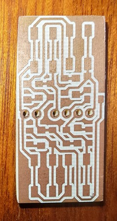{ width="400" }
*Figura 4.7: Placa de circuito impreso (PCB) finalizada tras completar las operaciones de desgaste, perforación y corte de contorno.*
