# 5. Simulación de Circuitos en NI Multisim

Antes de la implementación física de cualquier circuito, es una práctica estándar en la ingeniería electrónica validar el comportamiento lógico y matemático de los componentes. En esta sección documentaremos dos procesos fundamentales en el entorno de simulación **NI Multisim**: el análisis de barrido en corriente continua (DC Sweep) de un transistor y la instrumentación virtual (rectificación de media onda).

---

## 5.1 Análisis de Barrido en Corriente Continua (DC Sweep)

El análisis **DC Sweep** nos permite someter un circuito a múltiples variaciones de voltaje o corriente de forma automatizada, generando una familia de curvas características que describen el comportamiento del componente (en este caso, un transistor BJT).

### Construcción del Circuito Base
El esquema base consta de un transistor NPN modelo `2N2222A` (etiquetado como `Q1`). Este componente es polarizado por dos fuentes independientes:
*   **Fuente de Voltaje (VCE):** Conectada al colector (malla derecha), será nuestra "Source 1".
*   **Fuente de Corriente (IB):** Conectada a la base (malla izquierda), será nuestra "Source 2".

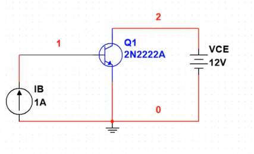{ width="500" }
*Figura 5.1.1: Topología del circuito de prueba para análisis DC.*

### Configuración de Parámetros de Barrido
Para configurar la simulación, nos dirigimos a la barra superior y seleccionamos la herramienta **`DC Sweep`** (indicada en el recuadro rojo de la siguiente imagen).

| Acceso a Herramienta | Parámetros de Fuentes |
| :---: | :---: |
| 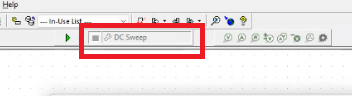{ width="400" } | 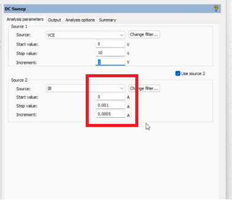{ width="400" } |

Dentro de la ventana de configuración, en la pestaña **Analysis parameters**, indicaremos al simulador qué valores van a ir cambiando[cite: 23]:
1.  **Source 1 (VCE):** Se define el rango de operación de la fuente de voltaje principal. Establecemos el valor inicial (`Start value`), el valor final (`Stop value`) a 10V, y determinamos de cuánto en cuánto incrementará.
2.  **Source 2 (IB):** Activamos la casilla "Use source 2" para anidar una segunda variación. Si deseamos modificar la cantidad de curvas que se graficarán, ajustamos el valor de `Increment` de la corriente de base (IB). En este ejemplo, el incremento está ajustado a `0.0005 A`, generando así un número específico de trazos.

### Selección de Variables de Salida (Output)
Para que el simulador sepa qué información debe graficar, debemos pasar a la pestaña **Output (Salidas)**[cite: 23].

1.  En la columna izquierda (`Variables in circuit`), localizamos y seleccionamos la variable que deseamos analizar; en este caso, la corriente de colector del transistor: `I(Q1[IC])`[cite: 23].
2.  Hacemos clic en el botón **Add** (Añadir) para trasladar la variable a la columna de análisis seleccionada a la derecha[cite: 23].
3.  Con la variable configurada, presionamos el botón **Run** (ícono verde de Play) en la parte inferior para iniciar el cálculo matemático[cite: 23].

| Selección de Variable Output | Ejecución de Simulación |
| :---: | :---: |
| 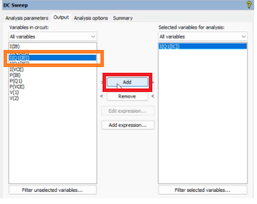{ width="400" } | 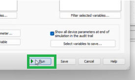{ width="400" } |

### Análisis del Graficador (Grapher View)
Al ejecutar la simulación, se desplegará una nueva ventana denominada **Grapher View** mostrando las "3 barridas" calculadas por el software basándose en los parámetros previamente ingresados[cite: 23].

El gráfico `DC Transfer Characteristic` nos muestra la corriente de colector (Eje Y) en función del voltaje colector-emisor (Eje X)[cite: 23]. El comportamiento se divide en tres curvas según la corriente de base (IB):

*   ⬇️ **Flecha Amarilla (Línea Roja):** Representa el estado de corte, donde la corriente de base (IB) es 0[cite: 23].
*   ➡️ **Flecha Naranja (Línea Verde):** Muestra el estado activo de amplificación cuando la corriente IB incrementó a 0.0005 A[cite: 23].
*   ⬆️ **Flecha Azul (Línea Azul):** Ilustra el punto de saturación superior, cuando IB alcanza su valor máximo configurado de 0.001 A[cite: 23].

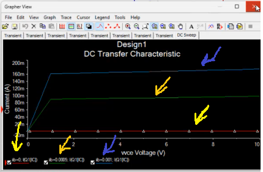{ width="700" }
*Figura 5.1.2: Familia de curvas características del transistor 2N2222A.*

---

## 5.2 Instrumentación Virtual: Rectificación de Media Onda

En esta segunda fase, utilizaremos herramientas de instrumentación virtual para analizar el comportamiento transitorio de una señal en corriente alterna (AC) al atravesar un diodo rectificador.

### Selección de Componentes y Ensamblaje
Nos dirigimos a la barra de herramientas superior y abrimos la base de datos de componentes haciendo clic en el icono del diodo.

| Icono de Base de Datos | Selección de Componentes |
| :---: | :---: |
| 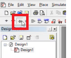{ width="200" } | 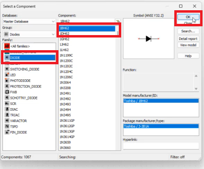{ width="300" } |

En la ventana emergente `Select a Component`[cite: 23]:
1.  Buscamos en el grupo de familias la opción **DIODE** y seleccionamos el modelo rectificador `1BH62`[cite: 23].
2.  Repetimos el proceso buscando la familia **RESISTOR** para insertar una resistencia de carga de `1kΩ`[cite: 23].

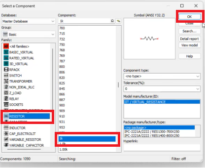{ width="500" }
*Figura 5.2.1: Selección de resistor desde la librería virtual.*

### Generación y Monitoreo de Señales

Para inyectar una señal alterna al circuito, debemos insertar un **Generador de Funciones** (`Function Generator`)[cite: 23]. Este se localiza en la barra de instrumentos virtual del lado derecho[cite: 23].

| Icono Generador | Interfaz de Configuración |
| :---: | :---: |
| 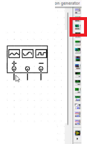{ width="150" } | 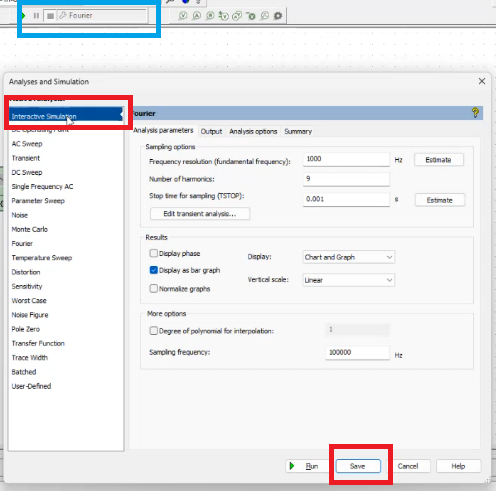{ width="350" } |

Haciendo doble clic sobre el bloque del generador (etiquetado como `XFG1`), configuramos los parámetros para simular la red eléctrica convencional[cite: 23]:
*   **Frecuencia (Frequency):** `60 Hz`[cite: 23].
*   **Amplitud (Amplitude):** `120 Vp` (Voltios pico)[cite: 23].

Para visualizar el resultado de la rectificación, añadimos un **Osciloscopio** desde la misma barra de instrumentos lateral (cuarto ícono)[cite: 23].

| Icono Osciloscopio | Circuito Interconectado |
| :---: | :---: |
| 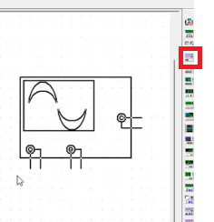{ width="150" } | 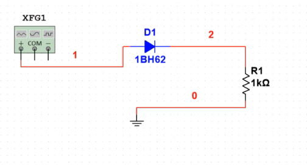{ width="450" } |

### Configuración del Modo Interactivo

Es crucial verificar que el simulador esté configurado correctamente para leer instrumentos en tiempo real. En el menú superior de simulación, debemos asegurarnos de que la opción seleccionada sea **`Interactive Simulation`**[cite: 23]. Si se deja en `DC Sweep` o en otro modo de análisis avanzado, el programa arrojará un error al intentar utilizar el osciloscopio[cite: 23].

| Menú de Tipo de Simulación | Confirmación Visual |
| :---: | :---: |
| 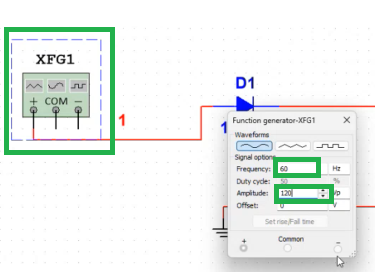{ width="300" } | 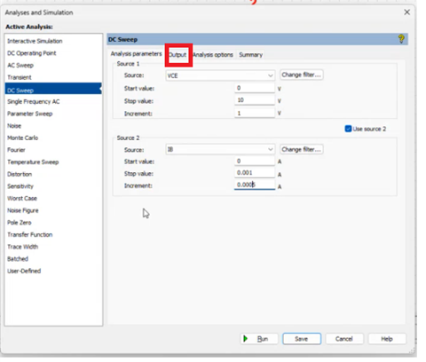{ width="300" } |

Al iniciar la simulación en modo interactivo, podremos hacer doble clic en el osciloscopio (`XSC1`) para visualizar la gráfica en tiempo real. El instrumento revelará la onda recortada, evidenciando el fenómeno físico de la rectificación de media onda provocado por el diodo al bloquear el semiciclo negativo de la señal senoidal original.

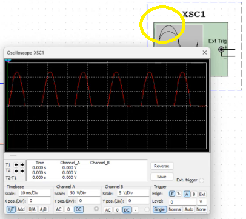{ width="600" }
*Figura 5.2.2: Forma de onda rectificada capturada por el osciloscopio virtual.*
